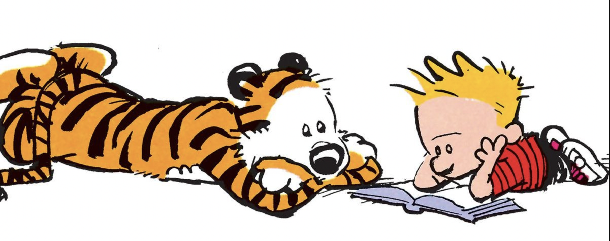

> "What really knocks me out is a book that, when you're all done reading it, you wish the author that wrote it was a terrific friend of yours and you could call him up on the phone whenever you felt like it. That doesn't happen much, though." --- J.D. Salinger, The Catcher in the Rye

 
These are the 36 books I have read in 2025 (so far!)  

### Fiction
- *Crime and Punishment* by Fyodor Dostoevsky. 1866
- *Siddhartha* by Herman Hesse. 1922 
- *A Clockwork Orange* by Anthony Burgess. 1962
- *Love Story* by Erich Segal. 1970
- *Jonathan Livingston Seagull* by Richard Bach. 1970
- *My Name Is Red* by Orhan Pamuk. 1998
- **Ian McEwan**  
  *Black Dogs*. 1992.  
  *Amsterdam*. 1998.  
  *Atonement*. 2001.  
  *Saturday*. 2005.
- **Virginia Woolf**  
  *Mrs Dalloway*. 1925  
  *To the Lighthouse*. 1927
- **Kazuo Ishiguro**  
  *A Pale View of Hills*. 1982  
  *An Artist of the Floating World*. 1986  
  *Remains of the Day*. 1989  
  *Never Let Me Go*. 2005  
  *Klara and the Sun*. 2021
- **Haruki Murakami**  
  *Norwegian Wood*. 1987  
  *The Wind-Up Bird Chronicle*. 1995  
  *Kafka on the Shore*. 2002  
  *What I Talk About When I Talk About Running*. 2007
- **Robert Jordan** &mdash; ***The Wheel of Time*** **series**   
  *The Eye of the World*. 1990  
  *The Great Hunt*. 1990  
  *The Dragon Reborn*. 1991  
  *The Shadow Rising*. 1992 
- *American Gods* by Neil Gaiman. 2001
- *There's Always This Year: On Basketball and Ascension* by Hanif Abdurraqib. 2024

### Non-fiction
- *A Sense of Where You Are: Bill Bradley at Princeton* by John McPhee. 1965
- *Oranges* by John McPhee. 1967
- *A People's History of the United States* by Howard Zinn. 1980
- *London: The Biography* by Peter Ackroyd. 2000
- *Elliptic Tales: Curves, Counting, and Number Theory*   by Avner Ash and Robert Gross. 2012
- *Never Split The Difference: Negotiating As If Your Life Depended On It*   by Christopher Voss, Tahl Raz. 2016
- *The Usefulness of Useless Knowledge* by Abraham Flexner. 2017
- *Purpose: What Evolution and Human Nature Imply about the Meaning of Our Existence*   by Samuel Wilkinson. 2024
- *The Formula: How Rogues, Geniuses, and Speed Freaks Reengineered F1 into the World's Fastest-Growing Sport* by Joshua Robinson and Jonathan Clegg. 2024
