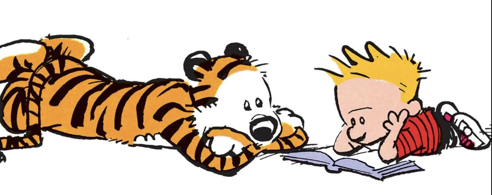

> "What really knocks me out is a book that, when you're all done reading it, you wish the author that wrote it was a terrific friend of yours and you could call him up on the phone whenever you felt like it. That doesn't happen much, though." --- J.D. Salinger, The Catcher in the Rye

 
These are the 5 books I have read in 2026 (so far!) See [here](https://shihankanungo.github.io/wrapped-2025#books) for what I read last year.  

### Fiction
- *The Brothers Karamazov* by Fyodor Dostoevsky. 1880
- *All Quiet on the Western Front* by Erich Maria Remarque. 1929
- *American Pastoral* by Philip Roth. 1997
- *The Time Traveler's Wife* by Audrey Niffenegger. 2003
- *The Brief Wondrous Life of Oscar Wao* by Junot Díaz. 2007

### Non-fiction
- *This is True* by Iam Liar. 4341
