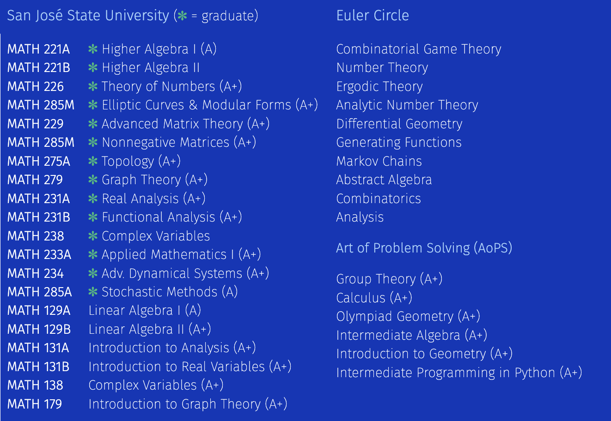

> "In mathematics you don't understand things. You just get used to them."   --- John von Neumann  
> "The irreducible price of learning is realizing that you do not know."   --- James Baldwin  
> "Education: the path from cocky ignorance to miserable uncertainty."   --- Mark Twain

  

I have undertaken advanced coursework at Euler Circle[^1] (2019--_now_) and at San José State University[^2] (SJSU, 2023--_now_) which have significantly enriched both the breadth of my expertise and the depth of my understanding. Or, as von Neumann would put it, they have simply helped me get used to some of mathematics. 
  

[^1]: Euler Circle, run by Dr. Simon Rubinstein-Salzedo, offers college-level mathematics classes, each 10 weeks long, with weekly problem sets to help gain familiarity with new material. At the end of the class we write an expository paper on a topic related to the class material. 
[^2]: At SJSU, courses run for 15 weeks and typically include 7 to 10 problem sets, two midterm exams, and a final exam. In graduate-level courses, there is often a project and/or presentation in lieu of the final. 

Here is a list of my coursework, with grades indicated where available---Euler Circle does not assign grades; they believe that grades tend to set achievement ceilings. 
   

 

Here are the courses grouped by subject area, along with a short description of each course. 
<!-- <small>You can scroll down for the same list, but grouped by institution instead. [ <b><a href="https://shihankanungo.github.io/courses#coursework-grouped-by-institution">Link</a></b> ]. </small>-->

## Analysis and Geometry 

<small><i>"logloglog x has been proved to go to infinity, but has never been observed to do so."</i> --- Anonymous</small>  
<small><i>"Analysis is the art of taming infinity."</i> --- Neil Falkner, Amer. Math. Monthly <b>116</b></small>  

<small><i>click on the title to see a short description</i></small>

<ul> 
<li>

  
<b>MATH 231A</b> <i>Real Analysis</i>. Fall 2024. SJSU (A+) 

  <small>Sigma algebras, differentiation, product measures, integration, the spaces <i>L</i>1 and <b>C</b>.</small> 
  <small>Textbook: Stein and Shakarchi. <i>Real Analysis: Measure Theory, Integration, and Hilbert Spaces</i>.</small>

</li>

<li>

  
<b>MATH 231B</b> <i>Functional Analysis</i>. Spring 2025. SJSU (A+) 

  <small>Function spaces and their duals, operators on function spaces, applications to analysis.</small> 
  <small>Textbook: Debnath and Mikusiński. <i>Introduction to Hilbert Spaces with Applications</i>.</small>

</li>

<li>

  
<b>MATH 233A</b> <i>Applied Mathematics I</i>. Spring 2025. SJSU (A+) 

  <small>Initial and boundary value problems for hyperbolic, parabolic and elliptic equations. Fourier series and transforms. Nonlinear partial differential equations.</small> 
  <small>Textbook: Peter John Olver. <i>Introduction to Partial Differential Equations.</i></small>

</li>

<li>

  
<b>MATH 234</b> <i>Advanced Dynamical Systems</i>. Spring 2024. SJSU (A+) 

  <small>Continuous and discrete systems; stability of equilibria and closed orbits, structural stability.</small> 
  <small>Textbook: Hirsch, Smale, Devaney. <i>Differential Equations, Dynamical Systems, & an Introduction to Chaos</i>.</small>

</li>

<li>

  
<b>MATH 275A</b> <i>Topology</i>. Fall 2025. SJSU (A+)

  <small>Topological spaces and associated concepts (e.g., subspaces, product spaces, quotient spaces); continuous functions; compactness, connectedness (including path connectedness) and their local versions; countability and separation axioms; compactifications and Tychonoff’s Theorem; paracompactness and metrization theorems.</small> 
  <small>Textbook: James Munkres. <i>Topology.</i></small>

</li>

<li>

  
<b>MATH 285A</b> <i>Stochastic Methods</i>. Spring 2025. SJSU (A) 

  <small>Monte Carlo methods, Metropolis-Hastings algorithm, random-number generation.</small> 
  <small>Textbook: Kalos and Whitlock. <i>Monte Carlo Methods.</i></small>

</li>

<li>

  
<b>Ergodic Theory</b> Winter 2024. Euler Circle 

  <small>Poincare recurrence theorem, invariant measures, multiple recurrence, Szemeredi's theorem.</small> 
  <small>Textbook: Simon Rubinstein-Salzedo. <i>Ergodic Theory.</i></small>

</li>

<li>

  
<b>Differential Geometry</b> Spring 2022. Euler Circle 

  <small>Curves, surfaces, curvature, Gauss' Theorema Egregium, Gauss-Bonnet Theorem.</small> 
  <small>Textbook: Andrew Pressley. <i>Elementary Differential Geometry.</i></small>

</li>

<li>

  
<b>Markov Chains</b> Fall 2020. Euler Circle  

  <small>Absorbing and ergodic Markov chains, mixing and stopping times, spectral analysis.</small> 
  <small>Textbook: Levin and Peres. <i>Markov Chains and Mixing Times.</i></small>

</li>

<li>

  
<b>MATH 131A</b> <i>Introduction to Analysis</i>. Spring 2024. SJSU (A+) 

  <small>Completeness and compactness of <b>R</b>. Continuity, uniform continuity, the derivative.</small> 
  <small>Textbook: Kenneth Ross. <i>Elementary Analysis: The Theory of Calculus.</i></small>

</li>

<li>

  
<b>MATH 131B</b> <i>Introduction to Real Variables</i>. Fall 2024. SJSU (A+)

  <small>The theory of the Riemann integral, sequences and series of functions, spaces of functions.</small> 
  <small>Textbook: Tim Hsu. <i>Fourier Series, Fourier Transforms, and Function Spaces: A Second Course in Analysis.</i></small>

</li>

<li>

  
<b>MATH 138</b> <i>Complex Variables</i>. Fall 2023. SJSU (A+)

  <small>Analytic functions, complex integration, residues and power series, conformal mapping.</small> 
  <small>Textbook: Zill and Shanahan. <i>Complex Analysis.</i></small>

</li>

<li>

  
<b>Analysis</b> Spring 2021. Euler Circle  

  <small>Set theory, formal constructions of the real numbers, limits, continuity, and infinite series.</small>

</li>
</ul>

<a href="https://shihankanungo.github.io/courses">↪️ Back to top</a>

## Algebra and Number Theory

<small>"Structures are the essence of mathematics, and algebra provides the language to describe them." --- Bourbaki</small>  
<small>"Number theorists are like lotus-eaters -- having tasted this food they can never give it up." --- Leopold Kronecker</small>

<small><i>click on the title to see a short description</i></small>

<ul> 
<li>

  
<b>Group Theory</b> Summer 2023. Art of Problem Solving (AoPS) (A+) 

  <small>Building groups from other groups, symmetries of geometric objects, constructing fields.</small>  
  <small>Textbook: Jeremy Copeland. <i>Groups and Fields.</i></small>

</li>

<li>

  
<b>MATH 221A</b> <i>Higher Algebra I</i> Fall 2025. SJSU (A) 

  <small>Topics from groups, rings, integral domains, modules, fields, vector spaces.</small>  
  <small>Textbook: Paulo Aluffi. <i>Algebra: Chapter 0.</i> Chapters 1&mdash;4</small>

</li>

<li>

  
<b>MATH 226</b> <i>Theory of Numbers</i> Spring 2024. SJSU (A+)

  <small>Primes in arithmetic progressions, partitions, modular group, and the Dedekind eta function.</small>  
  <small>Textbook: Tom Apostol. <i>Introduction to Analytic Number Theory.</i></small>

</li>

<li>

  
<b>MATH 285M</b> <i>Elliptic Curves and Modular Forms</i> Fall 2025. SJSU (A+)

  <small>Elliptic curves, modular curves, modular forms, L-functions.</small>  
  <small>Textbook: Álvaro Lozano-Robledo. <i>Elliptic Curves, Modular Forms, and Their L-functions.</i></small>

</li>

<li>

  
<b>(Advanced) Number Theory</b> Fall 2023. Euler Circle

  <small>Reciprocity theorems, quadratic forms, elliptic curves, modular curves.</small>  
  <small>Textbook: David Cox. <i>Primes of the form x2+ny2</i>, and  
  Ireland and Rosen. <i>A Classical Introduction to Modern Number Theory;</i> </small>

</li>

<li>

  
<b>Analytic Number Theory</b> Spring 2024. Euler Circle

  <small>Dirichlet’s Theorem, The Prime Number Theorem, Brun's theorem, smooth numbers.</small>  
  <small>Textbook: Simon Rubinstein-Salzedo. <i>Analytic Number Theory.</i></small>

</li>

<li>

  
<b>Number Theory</b> Fall 2019. Euler Circle

  <small>Modular arithmetic, Fermat's little theorem, sums of two squares, <i>p</i>-adic numbers.</small>

</li>

<li>

  
<b>Abstract Algebra</b> Spring 2020. Euler Circle

  <small>Group theory, Sylow theorems, fields and extensions, number fields, Galois correspondence.</small>  
  <small>Textbook: Dummit and Foote. <i>Abstract Algebra.</i></small>

</li>
</ul>

<a href="https://shihankanungo.github.io/courses">↪️ Back to top</a>

[//]: # (- **MATH 128B** *Abstract Algebra II*. Spring 2025. SJSU  )
[//]: # (  <small>Emphasis on rings, integral domains, fields, field extensions, Galois theory.</small>)

## Representation Theory

<small><i>"The philosophy of representation theory is that it is a kind of linearization of abstract algebra."</i> --- Fulton & Harris, Representation Theory: A First Course</small>  
<small><i>"The essence of representation theory is to take a complicated mathematical object and study it by looking at how it acts on simpler objects, like vector spaces."</i> --- Michael Atiyah</small><i>

I haven't taken a formal course in representation theory, but I gained substantial knowledge while working on my 2024 project at MIT PRIMES-USA. In particular, I studied the subject through the following books:

- **Karin Erdmann.** (2006) *Introduction to Lie algebras*. <small>Springer Verlag, London.</small>
- **Humphreys, J.E.** (1972) *Introduction to Lie Algebras and Representation Theory*.  <small>Springer Verlag, New York.</small>
- **Humphreys, J.E.** (2008) *Representations of Semisimple Lie Algebras in the BGG Category O*. <small>Graduate Studies in Mathematics 94, AMS</small>
- **Cheng, S. and Wang, W.** (2012) *Dualities and Representations of Lie Superalgebras*.  <small>Graduate Studies in Mathematics 144, AMS</small>
- **Ian. M. Musson.** (2012) *Lie Superalgebras and Enveloping Algebras*.  <small>Graduate Studies in Mathematics 131, AMS</small>
- **Alexander Molev.** (2007) *Yangians and Classical Lie algebras*.  <small>Mathematical Surveys and Monographs 143, AMS</small>
- **Pavel Etingof and Arun Kannan.** (2021) *Lectures on Symmetric Tensor Categories*. <small>\[[arXiv](https://arxiv.org/pdf/2406.10201)\]</small>

<a href="https://shihankanungo.github.io/courses">↪️ Back to top</a>

## Linear Algebra and Matrix Theory

<small><i>"It is my experience that proofs involving matrices can be shortened by 50% if one throws the matrices out."</i> --- Emil Artin (Geometric Algebra, p. 14)</small> 

<small><i>click on the title to see a short description</i></small>

<ul> 
<li>

  
<b>MATH 229</b> <i>Advanced Matrix Theory</i> Fall 2024. SJSU (A+)

  <small>Eigenvalues, unitary equivalence and Schur’s theorem. Normal, Hermitian and symmetric real matrices. Positive definite matrices, polar and singular value factorizations</small>  
  <small>Textbook: Horn and Johnson. <i>Matrix Analysis</i></small>

</li>

<li>

  
<b>MATH 285M</b> <i>Nonnegative matrices & Perron-Frobenius Theory</i> Spring 2025. SJSU (A+)

  <small>Perron Theory for positive matrices, Frobenius Theory for irreducible matrices, spectral graph theory, spectral digraph theory.</small>  
  <small>Textbook: Horn and Johnson. <i>Matrix Analysis</i>; C. Godsil and G. Royle. <i>Algebraic Graph Theory</i>, GTM 207.</small>

</li>

<li>

  
<b>MATH 129A</b> <i>Linear Algebra I</i> Fall 2023. SJSU (A)

  <small>Matrices, systems of linear equations, eigenvectors and eigenvalues, inner product spaces.</small>

</li>

<li>

  
<b>MATH 129B</b> <i>Linear Algebra II</i> Spring 2024. SJSU (A+)

  <small>Cayley-Hamilton theorem, minimal polynomials, Jordan canonical form, inner products.</small>  
  <small>Textbook: Friedberg, Insel, and Spence. <i>Linear Algebra.</i></small>

</li>
</ul>

<a href="https://shihankanungo.github.io/courses">↪️ Back to top</a>

## Combinatorics and Graph Theory

<small><i>"Counting pairs is the oldest trick in combinatorics... every time we count pairs, we learn something from it."</i> --- Gil Kalai</small>

<small><i>click on the title to see a short description</i></small>

<ul> 
<li>

  
<b>MATH 279A</b> <i>Graph Theory</i> Fall 2024. SJSU (A+)

  <small>Graphs, digraphs, trees, networks, connectedness, eulerian circuits, hamiltonian cycles, graph embeddings, matchings, factorizations, graph colorings and Ramsey theory.</small>  
  <small>Textbook: Douglas West. <i>Introduction to Graph Theory.</i></small>

</li>

<li>

  
<b>Generating Functions.</b> Fall 2021. Euler Circle

  <small>Ordinary, exponential and multivariate generating functions, growth rate and asymptotic analysis.</small>  
  <small>Textbook: Flajolet and Sedgewick. <i>Analytic combinatorics;</i> Herbert S Wilf. <i>generatingfunctionology.</i></small>

</li>

<li>

  
<b>Combinatorial Game Theory.</b> Fall 2024. Euler Circle

  <small>Nim, Hackenbush, surreal numbers, impartial games, Sprague-Grundy theory.</small>  
  <small>Textbook: Simon Rubinstein-Salzedo. <i>Combinatorial Game Theory.</i></small>

</li>

<li>

  
<b>MATH 179</b> <i>Introduction to Graph Theory</i> Fall 2024. SJSU (A+)

  <small>Hamiltonian and Eulerian properties, matching, trees, connectivity, coloring problems and planarity.</small>  
  <small>Textbook: Robin Wilson. <i>Introduction to Graph Theory.</i></small>

</li>

<li>

  
<b>Combinatorics</b> Winter 2020. Euler Circle

  <small>Binomial coefficients, double-counting; Stirling numbers; counting labeled trees.</small>

</li>
</ul>

<a href="https://shihankanungo.github.io/courses">↪️ Back to top</a>

   

