 
> "Ask yourself if what you’re doing today is getting you closer to where you want to be tomorrow." --- Paulo Coelho 

  

# Courses
I have undertaken advanced coursework at Euler Circle[^1] and at San José State University[^2]. 

[^1]: Euler Circle, run by Dr. Simon Rubinstein-Salzedo, offers college-level mathematics classes, each 10 weeks long, with weekly problem sets to help gain familiarity with new material. At the end of the class we write an expository paper on a topic related to the class material. 
[^2]: At SJSU, courses run for 15 weeks and typically include 7 to 10 problem sets, two midterm exams, and a final exam. In graduate-level courses, there is often a project and/or presentation in lieu of the final. 

<small><i>click on the title to see a short description</i></small>

<ul> 
<li>

  
<b>MATH 221A</b> <i>Higher Algebra I</i> Fall 2025. SJSU (A) 

  <small>Set theory and categories, group theory, Sylow theorems, rings and modules.</small>  
  <small>Textbook: Paulo Aluffi. <i>Algebra: Chapter 0.</i> Chapters 1&mdash;4</small>

</li>

<li>

  
<b>MATH 221B</b> <i>Higher Algebra II</i> Spring 2026. SJSU (A+) 

  <small>Irreducibility and factorization in integral domains, linear algebra, Tor and Ext functors, Galois theory.</small>  
  <small>Textbook: Paulo Aluffi. <i>Algebra: Chapter 0.</i> Chapters 5&mdash;9</small>

</li>

<li>

  
<b>MATH 285M</b> <i>Elliptic Curves and Modular Forms</i> Fall 2025. SJSU (A+)

  <small>Elliptic curves, modular curves, modular forms, L-functions.</small>  
  <small>Textbook: Álvaro Lozano-Robledo. <i>Elliptic Curves, Modular Forms, and Their L-functions.</i></small>

</li>

<li>

  
<b>MATH 238</b> <i>Advanced Complex Variables</i>. Spring 2026. SJSU (A+) 

  <small>Cauchy’s Theorem, Meromorphic Functions, Residue Theorem, Fourier Transforms, Conformal Mappings.</small> 
  <small>Textbook: Stein and Shakarchi. <i>Complex Analysis</i>.</small>

</li>

<li>

  
<b>Complex Analysis I</b> Spring 2026. Euler Circle (self-study)

  <small>Cauchy integral formula, residues & series, branch points, Riemann surfaces, products, Gamma function.</small> 
  <small>Textbook: Simon Rubinstein-Salzedo. <i>Complex Analysis.</i> Chapters 1&mdash;9</small>

</li>

<li>

  
<b>Complex Analysis II</b> Summer 2026. Euler Circle (self-study) 

  <small>The Hadamard product, conformal mappings, Riemann mapping theorem, elliptic functions, Picard’s little theorem, the Wiener–Ikehara theorem, analytic continuation, the prime number theorem, Theta functions.</small> 
  <small>Textbook: Simon Rubinstein-Salzedo. <i>Complex Analysis.</i> Chapters 10&mdash;18</small>

</li>

<li>

  
<b>MATH 275A</b> <i>Topology</i>. Fall 2025. SJSU (A+)

  <small>Topological spaces and associated concepts (e.g., subspaces, product spaces, quotient spaces); continuous functions; compactness, connectedness (including path connectedness) and their local versions; countability and separation axioms; compactifications and Tychonoff’s Theorem; paracompactness and metrization theorems.</small> 
  <small>Textbook: James Munkres. <i>Topology.</i></small>

</li>

<li>

  
<b>Differential Topology</b> Spring 2026 (self-study)

  <small>I read the entire textbook and solved the exercises at the end.</small> 
  <small>Textbook: John Milnor. <i>Topology from the differentiable viewpoint.</i></small>

</li>

<li>

  
<b>Combinatorics</b> Spring 2026. Euler Circle (self-study)

  <small>Special numbers, rising and falling factorials, sieving, restricted permutations, posets, incidence algebras, generating functions, recurrences and convolutions.</small> 
  <small>Textbook: Simon Rubinstein-Salzedo. <i>Combinatorics.</i></small>

</li>

</ul>

<a href="https://shihankanungo.github.io/gap-year-math">↪️ Back to top</a>

 

# Papers

## Research publications and preprints

- Upper Bounds for Sequence Saturation.  
  **S. Kanungo**. *Discrete Mathematics*. Submitted Dec 19, 2025.  
  \[ [arXiv](https://arxiv.org/abs/2512.17683) \]

- Representations of the Periplectic Supergroup in the Verlinde Category.  
  A. Kannan, **S. Kanungo**. *In preparation*.  
  \[ [description](https://shihankanungo.github.io/arun-26) \]
  
## Expository 
<small><i>click on the title to see a short description</i></small>

<ul>
<li>

  
<i>Elliptic Functions and Eisenstein Series</i>. <small>Complex Analysis, Number Theory</small> [ <a href="https://arxiv.org/abs/2606.14940" target="_blank" style="text-decoration: none">arXiv</a> ] 

  <small>We provide an introduction to elliptic functions and Eisenstein series from a classical analytic perspective while highlighting their broader mathematical significance. The exposition assumes familiarity with basic complex analysis, particularly meromorphic functions, contour integration, and power series expansions. </small> 

</li>

<li>

  
<i>The Grothendieck Group and K-Theory</i>. <small>Algebra, Algebraic Topology</small> [ <a href="https://arxiv.org/abs/2606.01492" target="_blank" style="text-decoration: none">arXiv</a> ] 

  <small>We develop the basic ideas underlying Grothendieck groups and to illustrate their appearance across algebra, topology, representation theory, and homological algebra. Motivated by the universal construction associated to a commutative monoid, we define the Grothendieck groups abelian categories and rings. Along the way we study several fundamental examples, including Euler characteristics, projective modules, and representation rings. We conclude with a discussion of <i>K</i>-theory and its applications, indicating how the elementary construction of <i>K</i>0 serves as the first layer of a much richer homotopical theory. </small> 

</li>

 
<li>

  
<i>The Fundamental Group</i>. <small>Algebraic Topology</small> [ <a href="fundgrp.pdf" target="_blank" style="text-decoration: none">PDF</a> ] 

  <small>We introduce the fundamental group as the first algebraic invariant of a topological space and the primary tool for detecting topological "holes." By lifting loops along the covering map and interpreting homotopy in terms of winding number, we compute the fundamental group of the circle to be the integers <b>Z</b>. </small> 

</li>

<li>

  
<i>Height, Krull Dimension, and Localization</i>. <small>Commutative Algebra</small> [ <a href="krull.pdf" target="_blank" style="text-decoration: none">PDF</a> ] 

  <small>This paper serves as a bridge between abstract ring theory and the geometric concepts of Algebraic Geometry. We explore how the Krull dimension, defined by chains of prime ideals, acts as the algebraic analogue of geometric dimension (e.g., points, curves, surfaces). We present localization as the algebraic tool that allows us to "zoom in" on a specific prime ideal to study the ring's isolated, local structure. </small> 

</li>

<li>

  
<i>Modular Curves as Moduli Spaces</i>. <small>Algebraic Geometry</small> [ <a href="moduli.pdf" target="_blank" style="text-decoration: none">PDF</a> ] 

  <small>We explore how modular curves corresponding to congruence subgroups encode elliptic curves with certain kinds of torsion subgroups. We also investigate the visualization of a modular curve $mdash; what it actually looks like from various perspectives; for example, as fundamental regions in the disk and upper half plane models of hyperbolic space, as a color map of an appropriate modular form, or as Riemann surfaces obtained by gluing parts of the boundary together and adding cusps to compactify. </small> 

</li>
</ul>

<a href="https://shihankanungo.github.io/gap-year-math">↪️ Back to top</a>

 

# Math contests

- **The 1st American Master of Mathematics, AMM 2026.** *Gold medal*. May 2026
- **USAMO (USA Mathematical Olympiad).** *Gold award* Mar 2026
- **The 17th Romanian Master of Mathematics, RMM 2026.** USA team. *Bronze medal*. Feb 2026
- **The 86th William Lowell Putnam Mathematical Competition.** *N2*, rank 22. Dec 2025
- **MOP (Mathematical Olympiad Program).** *'Blue' MOP*. Jun 2025

<a href="https://shihankanungo.github.io/gap-year-math">↪️ Back to top</a>

 

# Attended talks

## Stanford University, Math Department Talks

### June 2025

<ul>
<li>

  
<b>NUMBER THEORY &mdash; David Zywina (Cornell)</b> 
    <i>There are infinitely many elliptic curves over the rationals of rank 2</i>

  <small>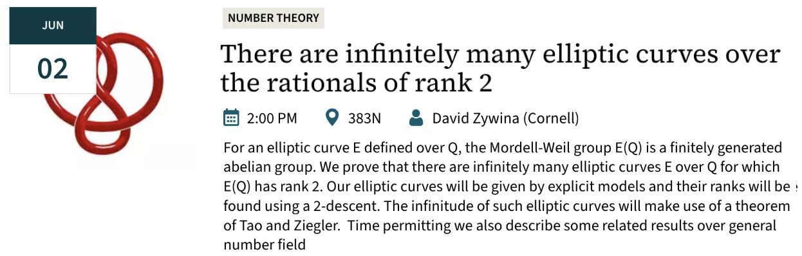</small>

</li>
</ul>

<ul>
<li>

  
<b>PROBABILITY &mdash; Chun Yin Siu (Stanford Psychiatry)</b> 
    <i>Random topology: The topology of preferential attachment graphs</i>

  <small>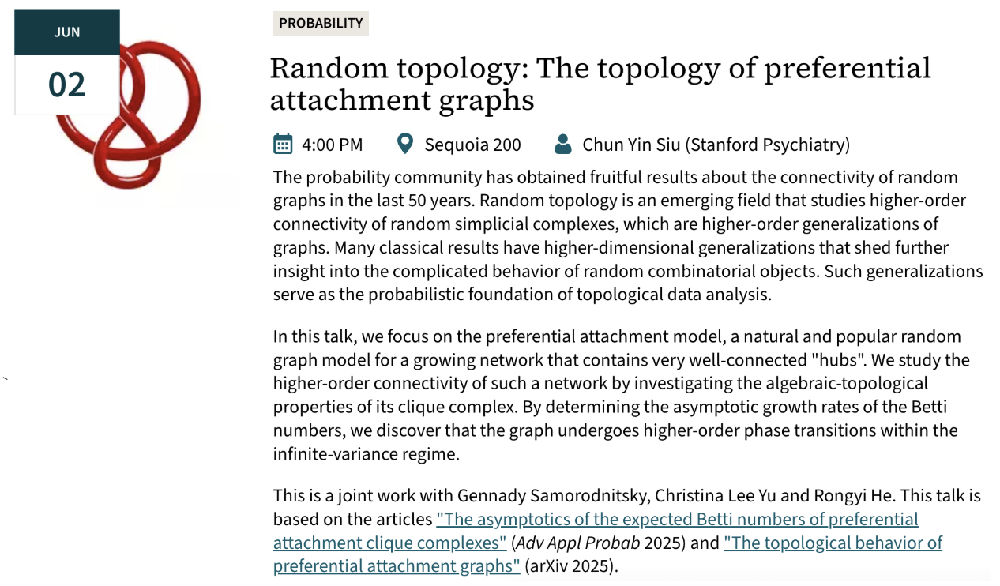</small>

</li>
</ul>

<ul>
<li>

  
<b>KIDDIE COLLOQUIUM &mdash; Milo Marsden (Stanford University)</b> 
    <i>Eigenvalues of Wigner Matrices: A dip into Random Matrix Theory</i>

  <small>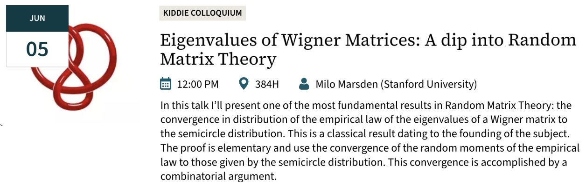</small>

</li>
</ul>

<ul>
<li>

  
<b>REPRESENTATION THEORY &mdash; Jeremy Taylor (UC Berkeley)</b> 
    <i>The universal monodromic Bezrukavnikov equivalence</i>

  <small>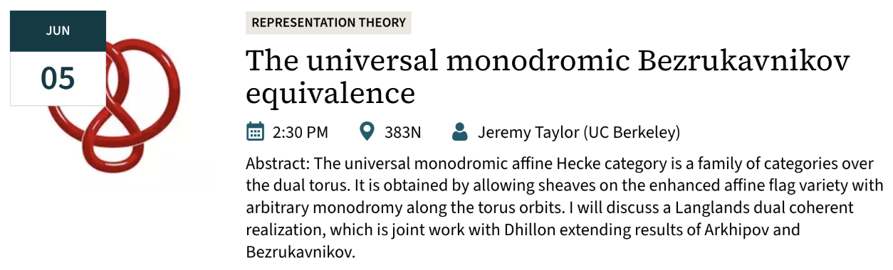</small>

</li>
</ul>

<ul>
<li>

  
<b>DEPARTMENT COLLOQUIUM &mdash; Aravind Asok (USC)</b> 
    <i>Constructing projective modules</i>

  <small>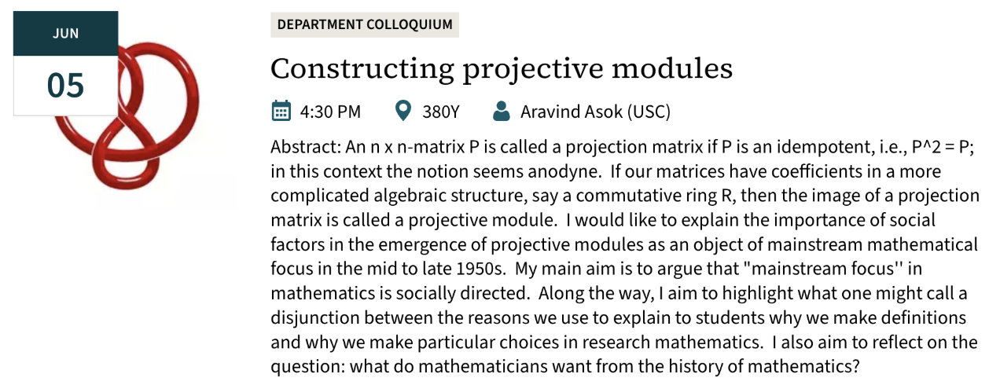</small>

</li>
</ul>

## MAA MathFest 2025. Sacramento, CA Aug 6--9.

<ul>
<li>

  
<b>Martin Gardner Lecture &mdash; Persi Diaconis, Stanford University</b> 
    <i>The Magic of Charles Sanders Peirce</i>

  <small>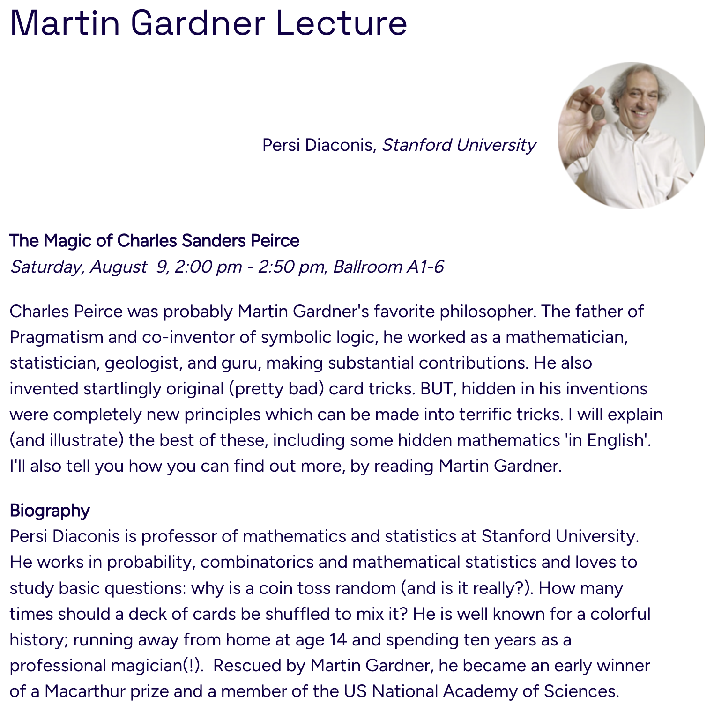</small>

</li>
 </ul>

## Stanford University, Math Department Talks

### September 2025

<ul>
<li>

  
<b>PROBABILITY &mdash; Volodymyr Riabov (IST, Austria)</b> 
    <i>The Zigzag strategy for random band matrices</i>

  <small>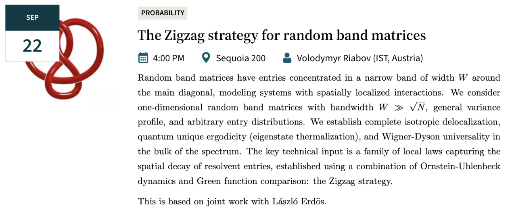</small>

</li>
</ul>

<ul>
<li>

  
<b>SYMPLECTIC GEOMETRY &mdash; Anastasiia Sharipova (Stanford)</b> 
    <i>Outer billiards and symplectic geometry</i>

  <small>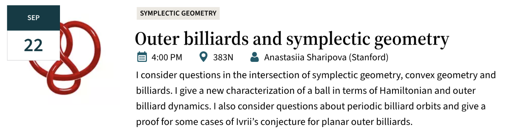</small>

</li>
</ul>

<ul>
<li>

  
<b>TOPOLOGY &mdash; Daren Chen (Caltech)</b> 
    <i>Two-component L-space links, satellites, and the tau-invariant</i>

  <small>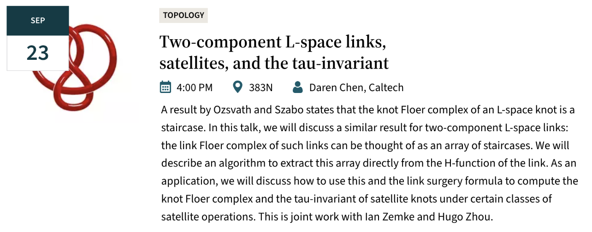</small>

</li>
</ul>

<ul>
<li>

  
<b>ANALYTIC NUMBER THEORY &mdash; Lasse Grimmelt (Cambridge)</b> 
    <i>The divisor function along arithmetic progressions</i>

  <small>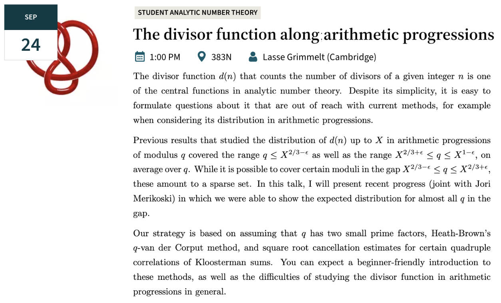</small>

</li>
</ul>

<ul>
<li>

  
<b>NUMBER THEORY &mdash; Jared Duker Lichtman (Stanford)</b> 
    <i>The abc conjecture almost always</i>

  <small>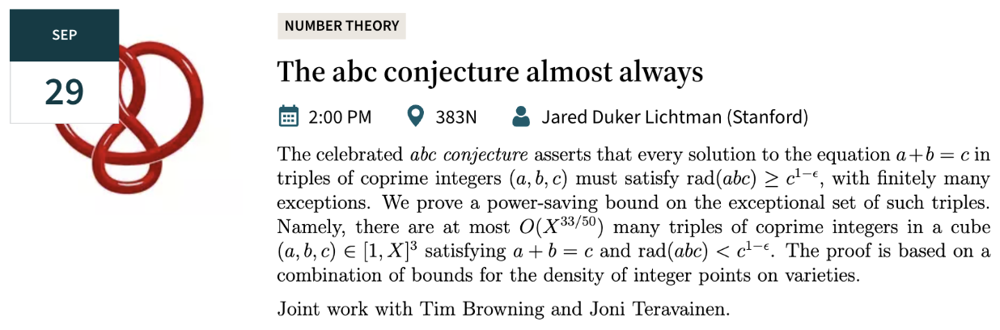</small>

</li>
</ul>

<ul>
<li>

  
<b>PROBABILITY &mdash; Izumi Okada (University of Tokyo)</b> 
    <i>Favorite sites for simple random walk in two and more dimensions</i>

  <small>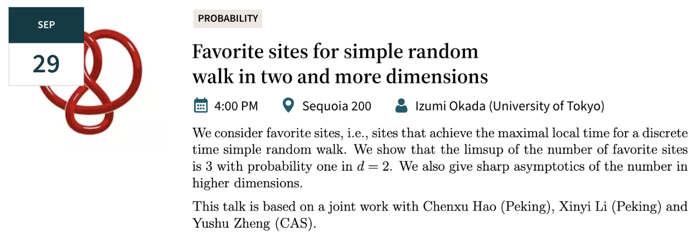</small>

</li>
</ul>

<ul>
<li>

  
<b>TOPOLOGY &mdash; Mona Merling (UPenn)</b> 
    <i>Equivariant algebraic K-theory of G-manifolds</i>

  <small>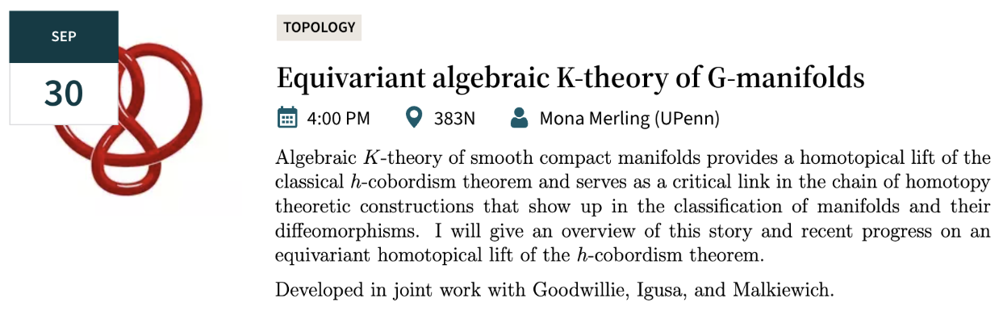</small>

</li>
</ul>

### October 2025

<ul>
<li>

  
<b>STUDENT ANALYTIC NUMBER THEORY &mdash; Nathan Tung (Stanford)</b> 
    <i>A new lower bound for Szemerédi's theorem with random differences in finite fields</i>

  <small>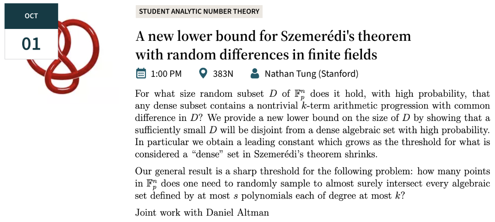</small>

</li>
</ul>

<ul>
<li>

  
<b>STUDENT ALGEBRAIC GEOMETRY &mdash; Ben Church (Stanford)</b> 
    <i>Abelian schemes and elliptic curves over <b>Z</b></i>

  <small>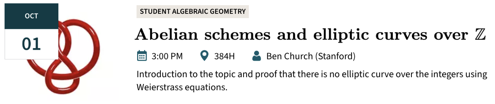</small>

</li>
</ul>

<ul>
<li>

  
<b>COMBINATORICS &mdash; Maria-Romina Ivan (Stanford)</b> 
    <i>Poset Saturation - From the Diamond to the General Case</i> 

  <small>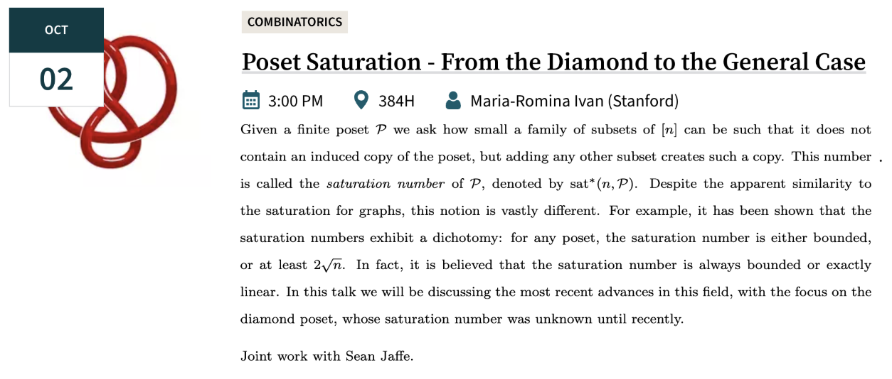</small>

</li>
</ul>

<ul>
<li>

  
<b>NUMBER THEORY &mdash; Shengtong Zhang (Stanford)</b> 
    <i>Chowla’s cosine problem through spectral graph theory</i>

  <small></small>

</li>
</ul>

<ul>
<li>

  
<b>TOPOLOGY &mdash; John Chae (Caltech)</b> 
    <i>Knot complements, series invariants and Lie superalgebra</i>

  <small>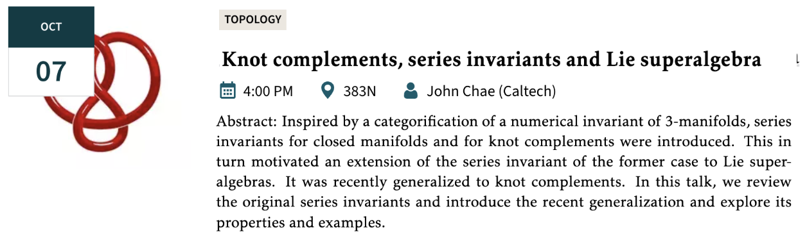</small>

</li>
</ul>

<ul>
<li>

  
<b>STUDENT ANALYTIC NUMBER THEORY &mdash; Zi Li Lim (UCLA)</b> 
    <i>Rational function progressions</i>

  <small>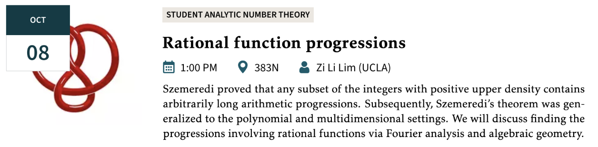</small>

</li>
</ul>

<ul>
<li>

  
<b>COMBINATORICS &mdash; Tara Abrishami (Stanford)</b> 
    <i>Beyond chordal graphs</i> 

  <small>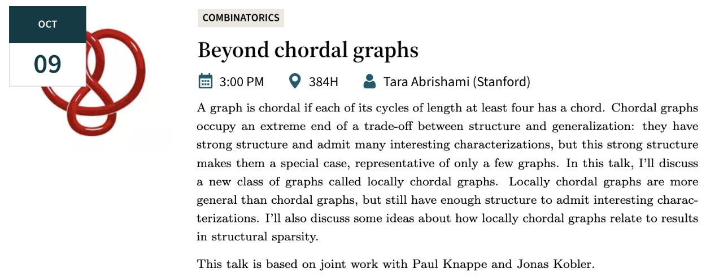</small>

</li>
</ul>

<ul>
<li>

  
<b>BERGMAN LECTURE &mdash; Yanir Rubinstein (University of Maryland, Stanford)</b> 
    <i>Invitation to Geometry via Mahler's Conjectures: a mathematical opera in three acts</i>

  <small>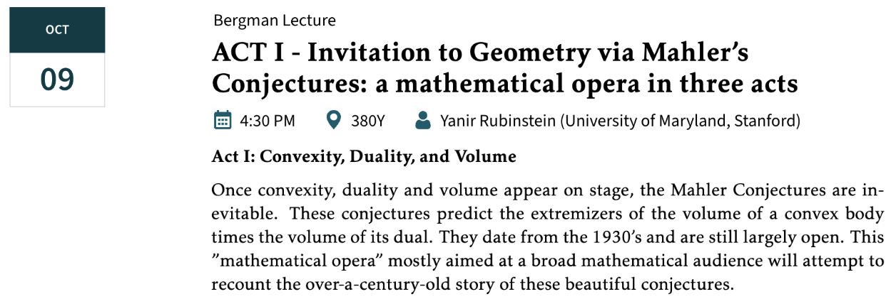</small>

</li>
</ul>

<ul>
<li>

  
<b>NUMBER THEORY &mdash; Mark Kisin (Harvard)</b> 
    <i>Reductions of crystalline representations</i>

  <small>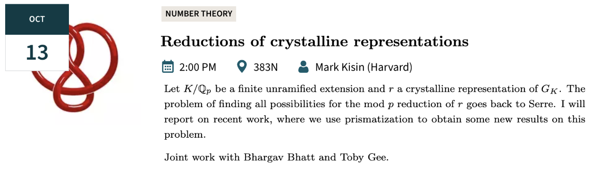</small>

</li>
</ul>

<ul>
<li>

  
<b>SYMPLECTIC GEOMETRY &mdash; Phil Morrison (UT Austin)</b> 
    <i>Flows on metriplectic manifolds</i>

  <small>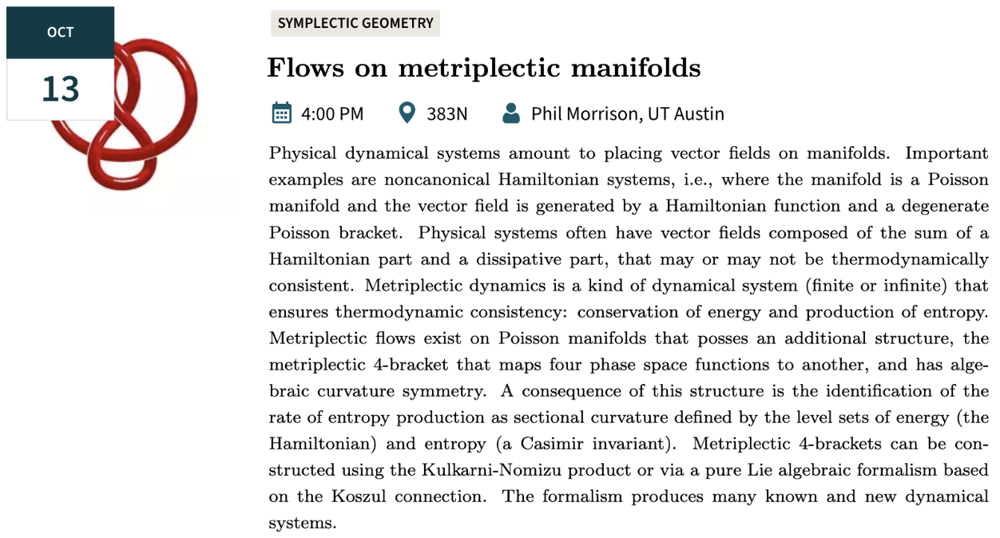</small>

</li>
</ul>

<ul>
<li>

  
<b>STUDENT ANALYTIC NUMBER THEORY &mdash; Tim Santens (Cambridge)</b> 
    <i>Local solubility of generalised Fermat equations</i>

  <small>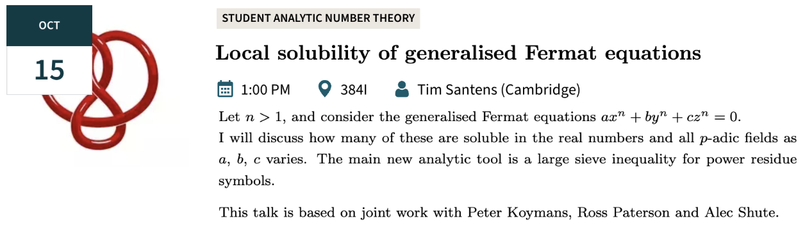</small>

</li>
</ul>

<ul>
<li>

  
<b>BERGMAN LECTURE &mdash; Yanir Rubinstein (University of Maryland, Stanford)</b> 
    <i>Invitation to Geometry via Mahler's Conjectures: a mathematical opera in three acts</i>

  <small>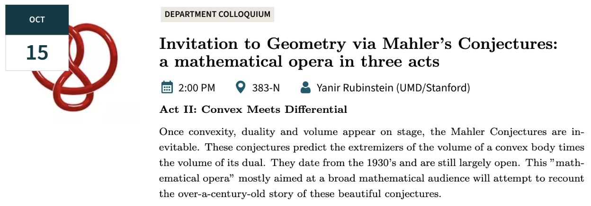</small>

</li>
</ul>

<ul>
<li>

  
<b>GEOMETRY &mdash; Riccardo Caniato (Caltech)</b> 
    <i>Area rigidity for the regular representation of surface groups</i>

  <small>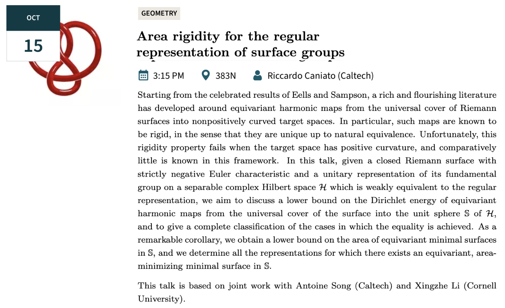</small>

</li>
</ul>

<ul>
<li>

  
<b>NUMBER THEORY &mdash; Ben Church (Stanford)</b> 
    <i>Shioda's conjecture on unirationality</i>

  <small>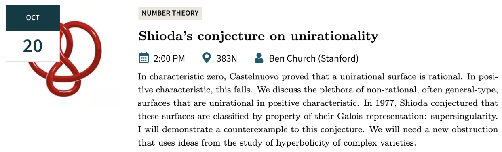</small>

</li>
</ul>

<ul>
<li>

  
<b>SYMPLECTIC GEOMETRY &mdash; Giovanni Ambrosioni (ETH)</b> 
    <i>Approximability for Lagrangian submanifolds</i>

  <small>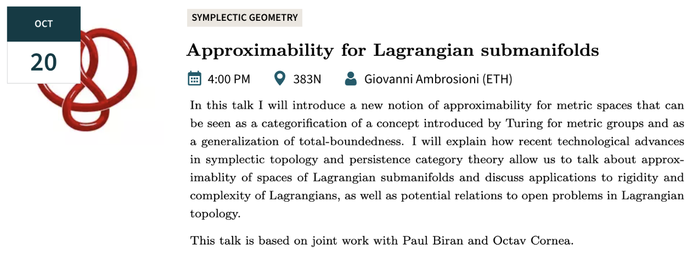</small>

</li>
</ul>

<ul>
<li>

  
<b>COMBINATORICS &mdash; Freddie Manners (UCSD)</b> 
    <i>Marton's Conjecture, aka the Polynomial Freiman--Ruzsa conjecture</i>

  <small>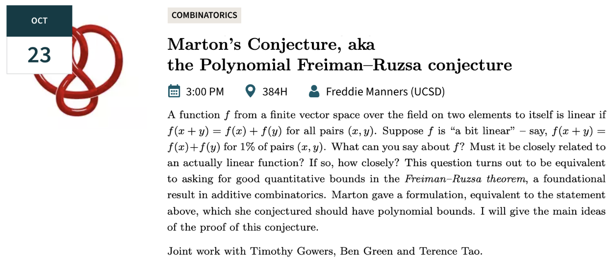</small>

</li>
</ul>

<ul>
<li>

  
<b>BERGMAN LECTURE &mdash; Yanir Rubinstein (University of Maryland, Stanford)</b> 
    <i>Invitation to Geometry via Mahler's Conjectures: a mathematical opera in three acts</i>

  <small>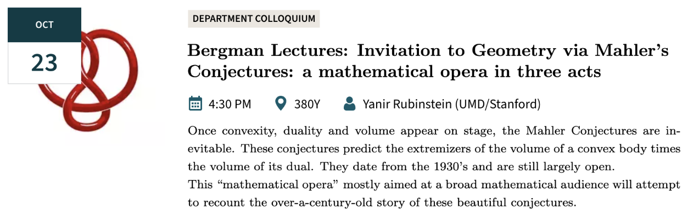</small>

</li>
</ul>

<ul>
<li>

  
<b>KIDDIE COLLOQUIUM &mdash; Carl Schildkraut (Stanford University)</b> 
    <i>Some peculiar p-groups and what they can do</i>

  <small>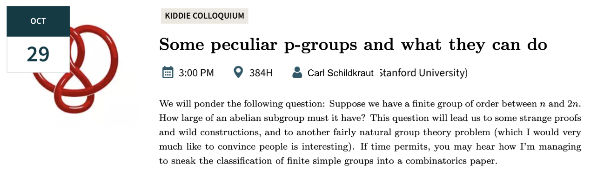</small>

</li>
</ul>

<ul>
<li>

  
<b>COMBINATORICS &mdash; Persi Diaconis (Stanford)</b> 
    <i>On sampling from an urn, without replacement</i>

  <small>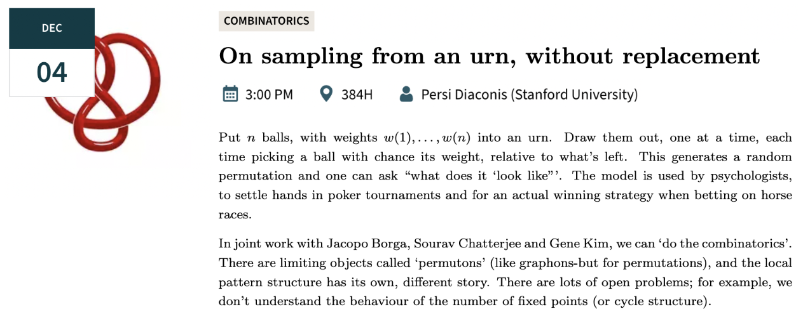</small>

</li>
</ul>

<ul>
<li>

  
<b>KIDDIE COLLOQUIUM &mdash; Daniel Kim (Stanford University)</b> 
    <i>How the government tries to</i> █████████████

  <small></small>

</li>
</ul>

<ul>
<li>

  
<b>STUDENT ANALYTIC NUMBER THEORY &mdash; Dor Minzer (MIT)</b> 
    <i>On inverse theorems, constraint satisfaction problems and combinatorial lines</i>

  <small>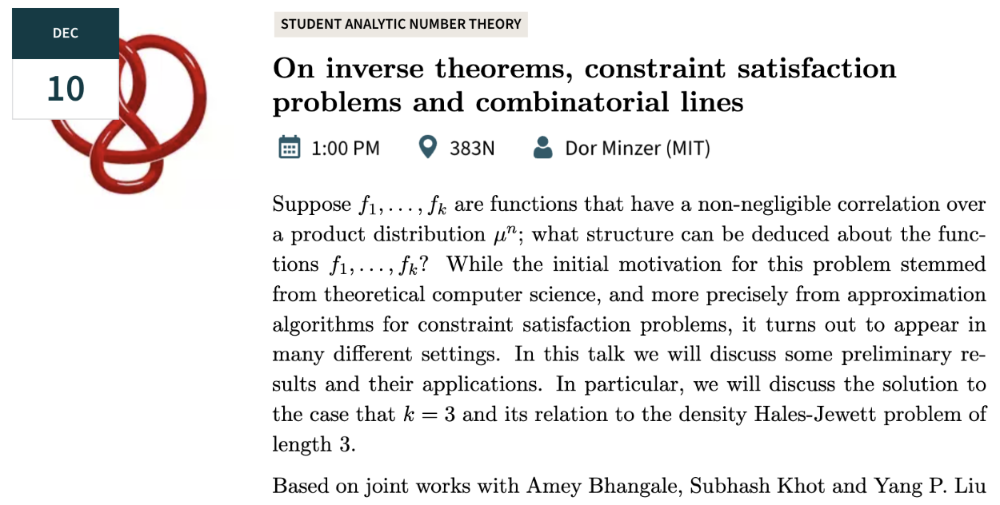</small>

</li>
</ul>

<ul>
<li>

  
<b>COMBINATORICS &mdash; Zach Hunter (ETH Zurich)</b> 
    <i>Improved lower bounds for multicolor van der Waerden numbers</i>

  <small>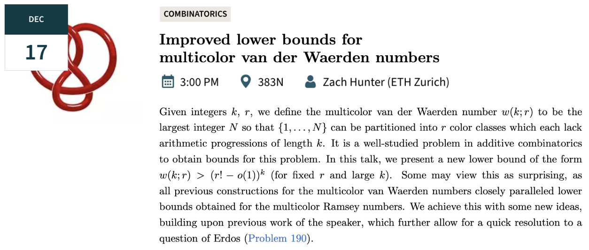</small>

</li>
</ul>

<ul>
<li>

  
<b>NUMBER THEORY &mdash; Brian Conrad, Stanford University</b> 
    <i>Finite subgroups of matrix groups over infinite fields</i>

  <small>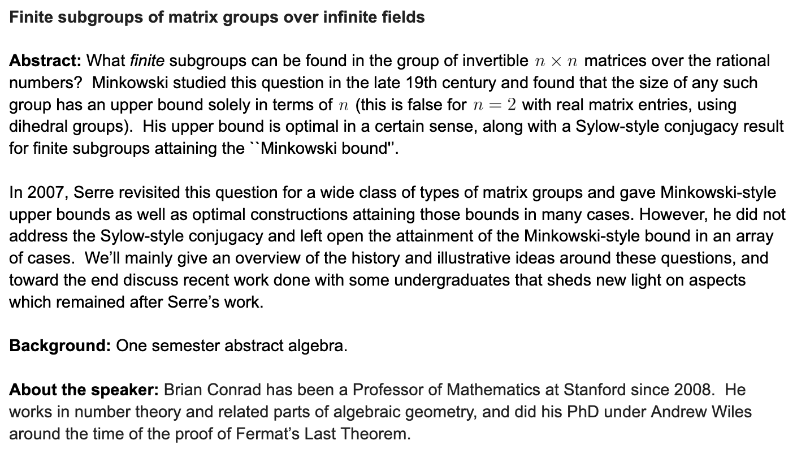</small>

</li>
 </ul>

 

 <ul>
<li>

  
<b>MODEL THEORY &mdash; Jacob Tsimerman, IAS/University of Toronto</b> 
    <i>The Ax–Grothendieck theorem: a gentle introduction to Model Theory</i>

  <small>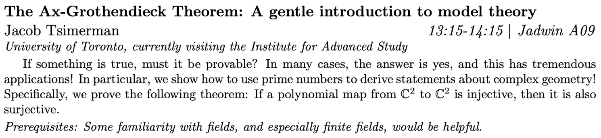</small>

</li>
</ul>

## Stanford University, Math Department Talks

### March 2026 (3)

<ul>
<li>

  
<b>DEPARTMENT COLLOQUIUM &mdash; Hong Wang (NYU Courant and IHES)</b> 
    <i>MRC Distinguished Lecture: A survey of Stein's restriction conjecture</i>

  <small></small>

</li>
 </ul>

<ul>
<li>

  
<b>NUMBER THEORY &mdash; Akshat Mudgal (Warwick)</b> 
    <i>Generalised sum-product phenomenon and a question of Bremner</i>

  <small></small>

</li>
</ul>

<ul>
<li>

  
<b>ANALYSIS &amp; PDE &mdash; Josh Zahl (Chern Institute)</b> 
    <i>Nikodym sets, maximal functions, and local smoothing</i>

  <small></small>

</li>
</ul>

### April 2026 (10)

<ul>
<li>

  
<b>STUDENT ANALYTIC NUMBER THEORY &mdash; Junho Peter Whang (Seoul National University)</b> 
    <i>On indefinite integral ternary quadratic forms</i>

  <small></small>

</li>
</ul>

<ul>
<li>

  
<b>COMBINATORICS &mdash; Mehtaab Sawhney (Columbia University; Open AI)</b> 
    <i>On the Maxima of Littlewood Polynomials</i>

  <small></small>

</li>
</ul>

<ul>
<li>

  
<b>COMBINATORICS &mdash; Mehtaab Sawhney (Columbia University; Open AI)</b> 
    <i>The Portion of Permutations fixing a k-Set</i>

  <small></small>

</li>
</ul>

<ul>
<li>

  
<b>REPRESENTATION THEORY &mdash; George Lusztig (MIT)</b> 
    <i>Fourier transform as a triangular matrix</i>

  <small></small>

</li>
</ul>

<ul>
<li>

  
<b>DEPARTMENT COLLOQUIUM &mdash; Nikos Frantzikinakis (University of Crete)</b> 
    <i>Quadratic Ramsey theory: old questions, new ideas</i>

  <small></small>

</li>
</ul>

<ul>
<li>

  
<b>NUMBER THEORY &mdash; Stepan Nesterov (Stanford)</b> 
    <i>Cyclic covers of the projective line and PSL(n,q) as Galois groups</i>

  <small></small>

</li>
</ul>

<ul>
<li>

  
<b>REPRESENTATION THEORY &mdash; Xuhua He (Hong Kong University)</b> 
    <i>Positivity of Canonical Bases</i>

  <small></small>

</li>
</ul>

<ul>
<li>

  
<b>DEPARTMENT COLLOQUIUM &mdash; Tony Feng (UC Berkeley; Google DeepMind)</b> 
    <i>The rise and ramifications of Artificial Mathematical Intelligence</i>

  <small></small>

</li>
</ul>

<ul>
<li>

  
<b>COMBINATORICS &mdash; Maya Sankar (IAS)</b> 
    <i>Entropy Methods for Rainbow Triangles and Properly Colored Cliques</i>

  <small>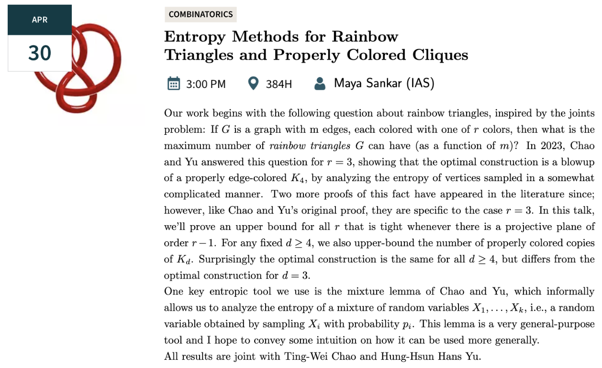</small>

</li>
</ul>

<ul>
<li>

  
<b>DEPARTMENT COLLOQUIUM &mdash; Josh Zahl (Chern Institute of Mathematics)</b> 
    <i>The Besicovitch compression phenomenon and the Kakeya set conjecture</i>

  <small>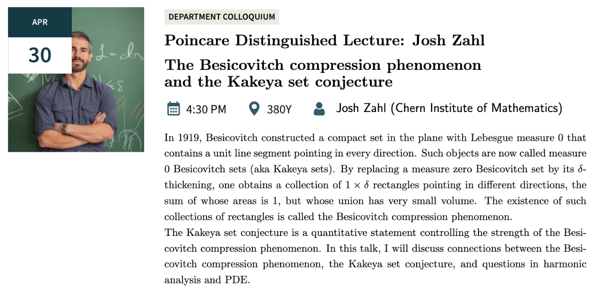</small>

</li>
</ul>

### May 2026 (14)

<ul>
<li>

  
<b>NUMBER THEORY &mdash; Sean Howe (Utah)</b> 
    <i>p-adic twistors and applications</i>

  <small>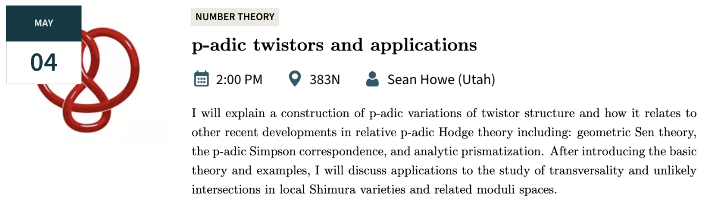</small>

</li>
</ul>

<ul>
<li>

  
<b>TOPOLOGY &mdash; Nathan Dunfield (UIUC)</b> 
    <i>Roots of Alexander polynomials of random positive 3-braids</i>

  <small>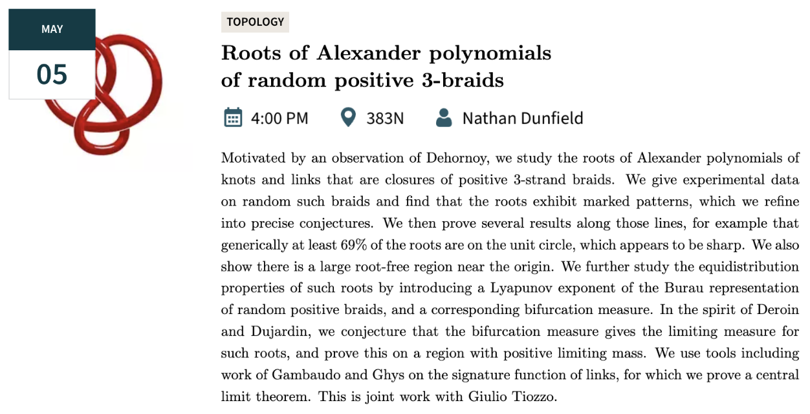</small>

</li>
</ul>

<ul>
<li>

  
<b>ALGEBRAIC GEOMETRY &mdash; Nathan Chen (Harvard University)</b> 
    <i>Characterizing algebraic varieties through symmetries</i>

  <small>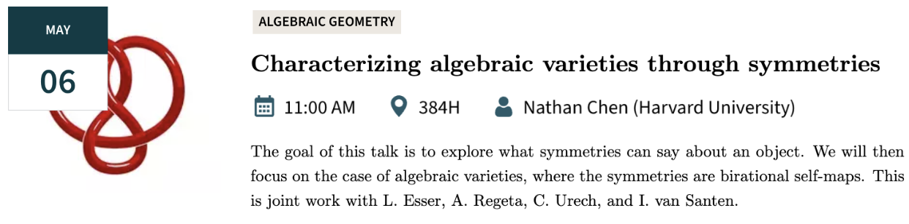</small>

</li>
</ul>

<ul>
<li>

  
<b>KIDDIE COLLOQUIUM &mdash; Qianhe Qin (Stanford)</b> 
    <i>To Be a Zootopologist: Cork or Spork?</i>

  <small>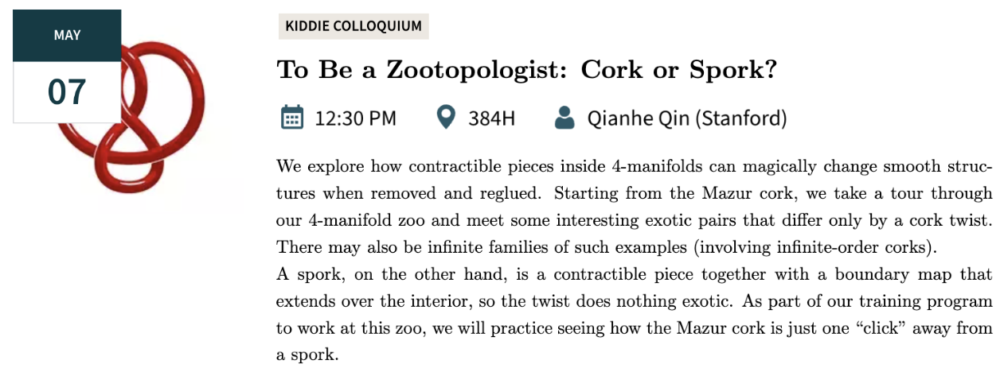</small>

</li>
 </ul>

 <ul>
<li>

  
<b>REPRESENTATION THEORY &mdash; Rahul Dalal (Succinct)</b> 
    <i>Automorphic Representations and Optimal Quantum Logic Gates</i>

  <small>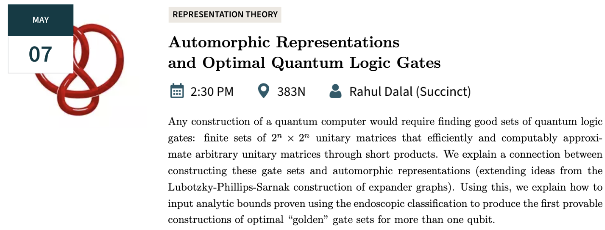</small>

</li>
 </ul>

<ul>
<li>

  
<b>NUMBER THEORY &mdash; Amichai Lampert (University of Michigan)</b> 
    <i>Polynomial bounds for Birch's theorem on forms</i>

  <small>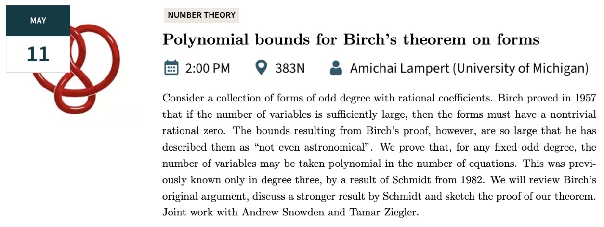</small>

</li>
</ul>

<ul>
<li>

  
<b>PROBABILITY &mdash; Sarah Peluse (Stanford)</b> 
    <i>Statistics of character tables of symmetric groups</i>

  <small>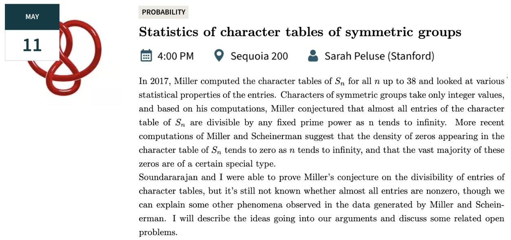</small>

</li>
</ul>

<ul>
<li>

  
<b>KIDDIE COLLOQUIUM &mdash; Daniel Kim (Stanford)</b> 
    <i>Shimura varieties and the Langlands program</i>

  <small>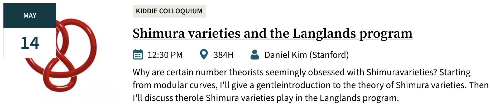</small>

</li>
 </ul>

<ul>
<li>

  
<b>COMBINATORICS &mdash; Boris Bukh (OpenAI and CMU)</b> 
    <i>Faster random walk via infrequent steering</i>

  <small>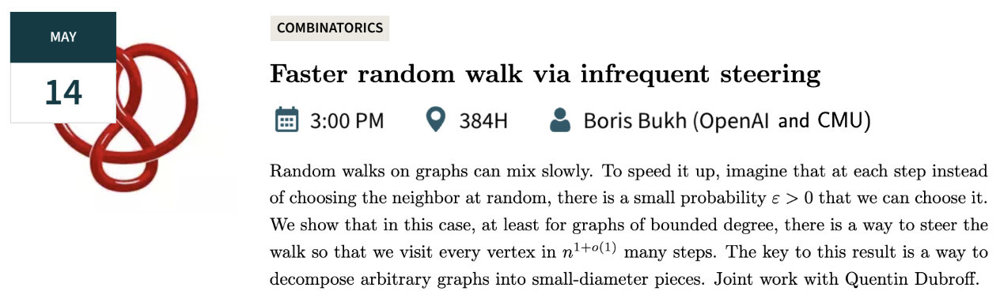</small>

</li>
</ul>

<ul>
<li>

  
<b>DEPARTMENT COLLOQUIUM &mdash; Yu Deng (University of Chicago)</b> 
    <i>Long time derivation of Boltzmann equation from hard sphere dynamics</i>

  <small>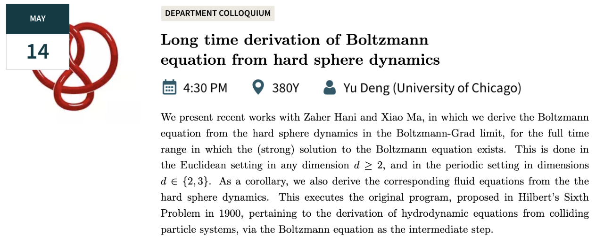</small>

</li>
</ul>

<ul>
<li>

  
<b>NUMBER THEORY &mdash; Jeremy Booher (University of Florida)</b> 
    <i>Iwasawa theory of Frobenius-torsion class group schemes</i>

  <small></small>

</li>
</ul>

<ul>
<li>

  
<b>NUMBER THEORY &mdash; Lue Pan (University of Michigan)</b> 
    <i>Plectic Galois action on the cohomology of Hilbert modular varieties</i>

  <small>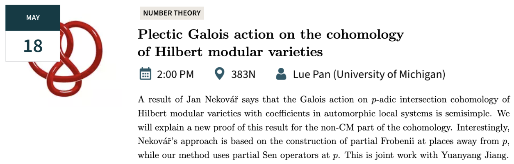</small>

</li>
</ul>

<ul>
<li>

  
<b>TOPOLOGY &mdash; Danny Ruberman (Brandeis University)</b> 
    <i>Equivalent exotic surfaces in small 4-manifolds</i>

  <small>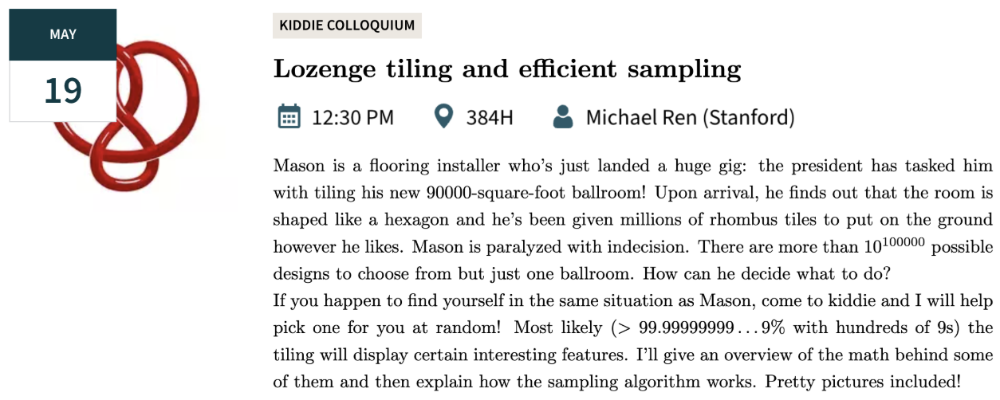</small>

</li>
</ul>

<ul>
<li>

  
<b>MRC PUBLIC LECTURE &mdash; Richard Schwartz (Brown University)</b> 
    <i>Paper Geometry &amp; Optimization</i>

  <small>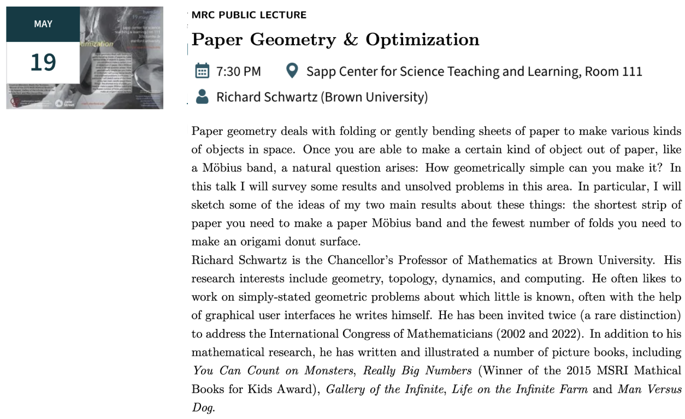</small>

</li>
</ul>

### June 2026 (3)

<ul>
<li>

  
<b>KIDDIE COLLOQUIUM &mdash; Travor Liu (Stanford)</b> 
    <i>Binary Quadratic Forms and the Zeros of Epstein's Zeta Function</i>

  <small>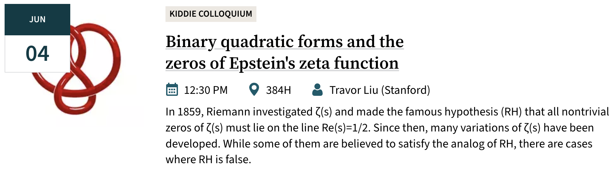</small>

</li>
</ul>

<ul>
<li>

  
<b>PROBABILITY &mdash; Andrew Lin (Stanford)</b> 
    <i>High-dimensional permutons: Theory and applications</i>

  <small>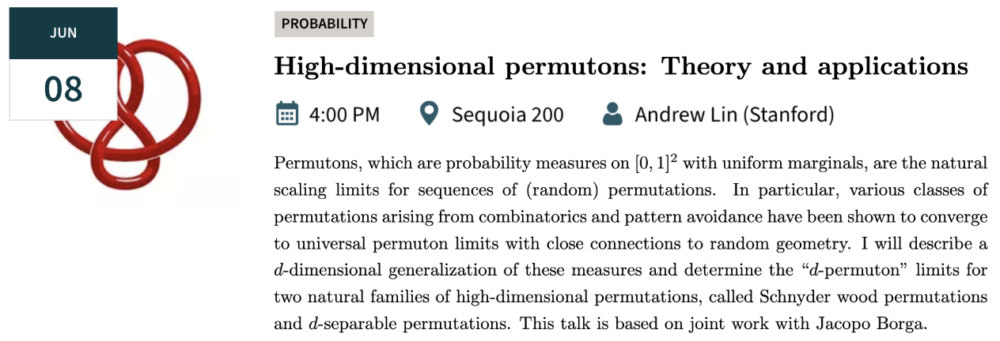</small>

</li>
</ul>

<ul>
<li>

  
<b>STUDENT ANALYTIC NUMBER THEORY &mdash; Noah Kravitz (Oxford)</b> 
    <i>The structure of sets with few subset sums</i>

  <small>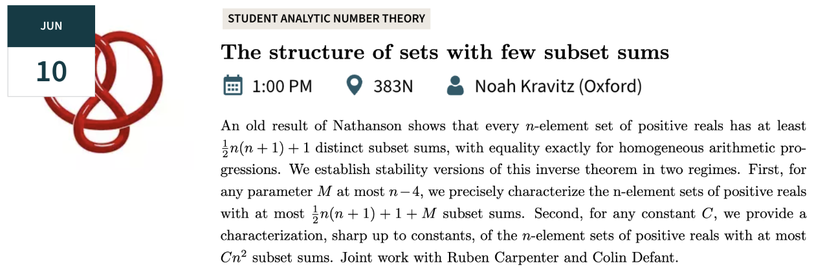</small>

</li>
</ul>

<a href="https://shihankanungo.github.io/gap-year-math">↪️ Back to top</a>
