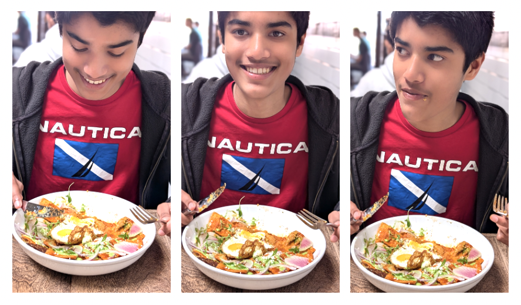

## Shenanigans

### Day 4: Sun Mar 30 (7 days to go)

Men's Final of the Miami Open Masters 1000: Djokovic vs. Jakub Mensik at 12PM PT.

I have been ordering iced coffee from Philz since you left. I like it and also, less memories attached to it, since you
prefer your drinks hot, not cold. 

Shihan is planning to go to _Sun of Wolf_ and order _chilaquiles_ for brunch. Sadly, that means we won't be visiting
_Olympus_. 

Revision/edits on _A_ are in hectic and full swing since morning. Arun was working past midnight yesterday. They are planning
a major overhaul of the organization of the paper, which improves the paper significantly. I am very happy that Arun finally has 
found some time to devote to this project. I am hopeful that this time the target deadline will be met and in fact, a much
improved paper will come out of it. 

I watched a movie last night: _The Trap_. It was not good. Actually, intended to watch _Beginners_(2011) but felt that you'd
have liked to watch it with me, so I couldn't bring myself to watch it without you. 

Right now obsessed with _Carsie Blanton_ ([YT playlist](https://music.youtube.com/playlist?list=PL6HQpYuOe1KXm15iel1h8rZCf0eWvL8P-&si=9YNGkXfj6Gn988Jl)) and _Kalie Shorr_ ([YT playlist](https://music.youtube.com/playlist?list=PL6HQpYuOe1KWqv28EcA8EAejIxaI8gdjg&si=iKKw7tontvssZABA)).  
**Carsie Blanton** is a singer-songwriter from Virginia, ran off at 16 to Oregon, then decided to turn pro and moved to Philadelphia 
but wound up in New Orleans. Songs are catchy, quotable, clever, sometimes cute.   
**Kalie Shorr** is a singer-songwriter from Maine, based in Nashville. Songs have some country in them and are often brash and pointed. 
Rocks harder than probably any Nashville ingenue since Miranda Lambert. 

Shihan doodled on the guitar during his pre-bedtime. He is missing you --- seems particularly bereft at bedtime.

### Day 3: Sat Mar 29 (8 days to go)

Shihan has managed to get a meeting out of Arun. They are meeting tomorrow (Sunday) at 6PM to discuss finishing touches for _A_. 
  Arun is hoping have this published in **Algebras and Representation Theory**, another Q1 journal.

**UPDATE:** Shihan has been pulling hostage-negotiation-shihanigans on Arun. Arun tried valiantly to wiggle out but Shihan
ruthlessly cornered him into yielding a deadline. Arun finally offered to get the paper ready by Apr 7. This is a HUGE win. 

Shihan has been working on _G_ this morning. He took care of his Saturday morning chore of laundry.

We will be ordering Chipotle burrito bowls for lunch. I'd say that qualifies as _healthy_, which means we haven’t had a single 
unhealthy meal since she left us to fend for ourselves in the Palo Alto wilderness.

Tennis: Jessica Pegula vs. Aryna Sabalenka in the Finals of the Miami Open Masters 1000!  
Sabalenka won. Djokovic plays tomorrow in the Men's Final.

1PM: Just got back from a very pleasant walk. The weather is incredible --- slight nip in the air, a gentle and crisp breeze, just
enough sunlight to make it pleasing, like a warm shower and incredible conversation. We are so fortunate to be living in such a 
beautiful neighborhood. Shihan is practicing violin now. 

**UPDATE:**  
5PM: The weather was so nice we went for a second walk. It was fantastic this time too!!  
We decided to have a late dinner at 7PM but when it was 7 Shihan said he would rather skip dinner. He did his music instead.
Shihan is cooking up some serious stuff on his MPK Mini Plus. 

Shihan is missing you. I'm not sure if you noticed, but he was overjoyed when you asked to speak with him. I doubt he will 
even mind a Zoom call with your entire "real family" in attendance.
