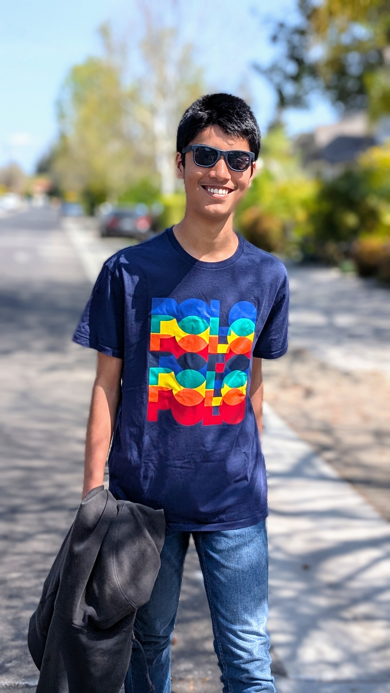

## Shenanigans

### Day 7: Wed Apr 2 (4 days to go)

> Spring is in the air ... wait, no, it's just pollen.

My allergies are in full rebellion --- I am sneezing like a malfunctioning sprinkler, sniffling like a sad movie character, and my eyes? 
Let’s just say they’ve gone full "red-eyed Sith Lord" mode.  😧 ☹️ 😬

Thank you so much 😚 for the UNIQLO shirts. I can sneeze into them in style. 

I finally replaced our rainbow-colored cutting mats. The old ones had seen too much---battle scars, exhaustion, probably some existential crises. 
The new ones arrived today, looking all fresh and vibrant, so I did what had to be done: tossed the old ones into a well-earned retirement.

Started reading _James_ at last! 

> "Way I sees it is dis. If'n ya gots to hab a rule to tells ya wha's good, if'n ya gots to hab good 'splained to ya, den ya cain't be good.
If’n ya need sum kinda God to tells ya right from wrong, den you won't never know." --- Percival Everett, James

It's a fun ride so far. Have you already finished it? If so, I expect a full book club analysis, preferably with 
dramatic reenactments.

Meanwhile, Shihan has been grinding ISL. Today’s highlight though? A lengthy discussion (read: lecture) on violin lessons. Honestly, I feel like 
he does not have any aspirations from it and is just going through the motions; and if that’s the case, I’m ready to cut the cord. Told him he 
needs to convince me why we should keep investing time and money into this. Debate scheduled for June 1. Also, if his scores keep tanking, that 
deadline might get ... expedited.

Went for a lovely walk today---perfect weather, good company, and deep discussions about the truly important things in life: tennis and soccer 
and such. 

### Day 6: Tue Apr 1 (5 days to go)

> **April Fool's Day!**   Here’s an interesting fact: In 1957, the **BBC pulled one of the most famous April Fool’s Day pranks** by airing a segment about the 
**Swiss Spaghetti Harvest.** The program showed Swiss farmers picking spaghetti from trees, claiming that a mild winter had led to a bumper crop. Viewers 
actually called in, asking how they could grow their own spaghetti trees! 🍝😂

It again rained today --- Shihan may have been onto something with his “let nature do the work” strategy re. the watering of mama's plants. A true visionary!

Big news: The "silver tube" from MIT arrived in the mail today! 

Inside? An offer of admission, a fancy certificate that screams "frame me", and, of course, some confetti (because MIT knows how to party). 
Also included: a sticker, which, in a move of great decisiveness, was instantly slapped onto the Chromebook---no hesitation there, pure instinct. 
There was also a goofy-nerdy-scifi poster, presumably to remind us all that MIT is, in fact, MIT.

Shihan is back in ISL _grind mode_. Four hours today. The boy is locked in. But, alas, he is starved of celestial encouragement---he misses your stars. :(

We ordered fish and rice for lunch today, from _Da Sichuan Bistro_. Perhaps a smidgen of extra salt in the fish, but otherwise quite tasty and healthy.

Post-lunch, we took a walk. It was peaceful. We pondered the mysteries of life. Also of Kanye West, and Eminem, and Gracie. A well-rounded discussion. 
We could feel a few drops of rain as we got back home.

130PM: It is still raining. Shihan has assumed his philosopher-in-the-window pose, perched on the living room sill, allegedly working on PRIMES project _G_. 
He requested tea, to which I complied. Now, he sips his mint-ginger chai with an air of deep contemplation. Progress on _G_? Unclear. But the tea? 10/10.

We miss you like an idiot misses the point---pretty much all the time. 😆

Stay tuned for further updates.
