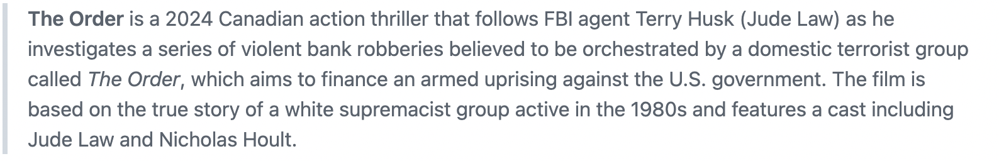
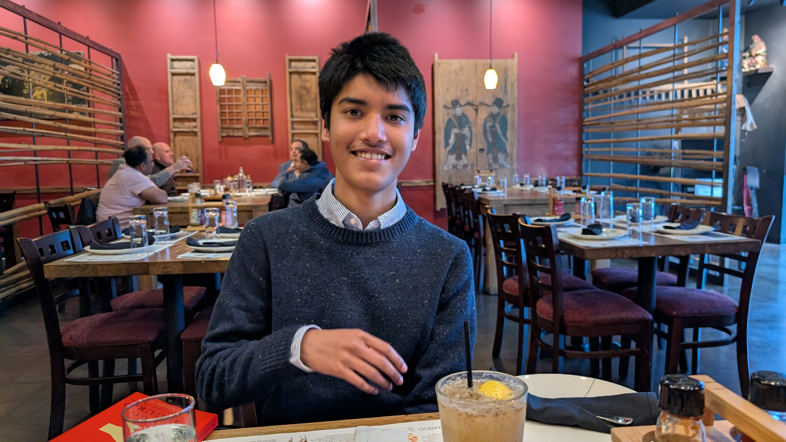

## Shenanigans

### Day 9: Fri Apr 4 (2 days to go)

It’s Friday, so of course, Ilsa came by! I chatted with her for a bit---she asked when you'd be back. I told her Monday and that 
you're off having loads of fun (possibly too much?). I also mentioned Iliyin and that your whole extended clan will be there, so 
she’s now fully updated on your social itinerary.

Arun unleashed a storm of emails last night---concern, confusion, probably a little existential despair. He demanded an emergency 
weekend summit... but unable to contain his anxiety, decided to have it this morning around 7AM. Yes, seven. A.M. On a Friday 
(because apparently nothing says "math crisis" like a sunrise summit) Anyway, crisis averted! They hashed it out, decisions were made, 
nods exchanged. They wrestled with the notation demons and came to an agreement. Arun is now on cleanup duty. April 7 is still in play. 
Everyone breathe.

However, this wave of frantic-ness distracted from the ISL grind. Only three hours today. Oh well! 

Shihan is putting in serious work on his new violin piece. Progress is being made, though the violin might not agree. Also, he’s racing through 
Klara and the Sun by Kazuo Ishiguro like it’s a beach read. He expressed a desire to read **all** of Ishiguro's works if I let him.
Kazuo Ishiguro should probably send him a thank-you note. 

We visited Casa Lupe for lunch. The server there knows us, our orders, where we like to sit and how we like our dishes customized. It
is a regal experience each time. Today was no different!

I took him to **Physics Bowl** at Gunn High. He said it was fun and casually bumped into Neil Dixit and Alex Tsagaan. You know, just 
catching up on the underground physics tea---which is probably teen-speak for trading gossip thinly disguised as academic conversation. 
You know how it goes.. 

Then I teleported him to Stanford for a talk on _Fluid Analysis_ or _Analytical Fluids_ or... just something fluid-y. The speaker? 
A grad student with... shall we say... avant-garde handwriting and a "formidable accent" (Shihan’s words). Our hero caught approximately 
2.5 words from the entire talk. He was mildly devastated. Throughout the drive back home, he buried himself in his Ishiguro and cultivated
an air of being spiritually wounded by the whole experience.

Jesse Geneson’s weekly pow-wow with Shihan has been postponed---he’s off visiting family on the East Coast. It's now happening Sunday at 6PM. 

Stay tuned for updates.

### Day 8: Thu Apr 3 (3 days to go)

> “Fiction is the lie through which we tell the truth.” --- Albert Camus

Watched _The Order_ last night. 

It was entertaining in a “discount Harry Potter meets secret society” kind of way. A fun watch, but nothing that’ll haunt my dreams or 
make me rethink my life choices.

Naturally, staying up for that masterpiece meant I was running on spiritual energy and caffeine fumes today. Had to tap out in the afternoon 
and take a nap---essentially a reboot with soft jazz and pillow drool.

Meanwhile, Shihan is still deep in his ISL training montage. Four more hours today!  He’s also tackling Putnam problems like a champ. 
The math gods are pleased.

On the research front, Shihan shifted focus to Project *G*, since Arun is currently bench-pressing Project *A* on his own. It still seems reasonable
to hope that the paper for _A_ will be finished in some form by April 7! 🤞 Project *G*, on the other hand, is being a proper villain to Shihan's superhero
---offering just the right level of resistance to be worthy of his considerable gifts.

Shihan also had a Discord chat with Schettler---like all good modern scholars do.  Schettler mentioned that AMM says the paper is “In review.” Which is 
academic code for: ¯\\_(ツ)_/¯. Obviously, no clue as to how long it will take from here for a decision to be made and communicated. Now we wait in silence 
like monks with WiFi.

We had pre-decided yesterday that Inchin’s was going to be our dinner holy land, so we skipped lunch in solemn anticipation. Shihan did manage to sneak in 
his “royal” breakfast---you know what that means. I treated myself to a **hot** *Philharmonic* from Philz after what felt like a decade. It felt like 
coming home, if home were slightly overpriced and extremely caffeinated. 

Today’s walk turned into a surprisingly deep TED Talk. We discussed the different categories of communication: (1) respond instantly or risk guilt 
forever, (2) respond when Mercury is in retrograde, and (3) pretend it never arrived. Also talked about Big Picture college agendas---interspersed, 
of course, with wisecracks, hypotheticals, and at least one impersonation of a confused academic. Here's a nugget:
> There are two types of people who use statistics: liars, and outliers!! --- Shihan

And then—Inchin’s! 

The menu: Chinese bhel, momos, and American chopsuey with three sunny-side-up eggs just chilling on the side, living their best lives. 
Masala lime sodas at hand. Everything was delicious and the service was classy in that “you forget they’re even there” way.

As we basked in post-dinner glow, Shihan turned to me and asked the real question: “Do you think we’re having a better time... or is Mom?”

Existential, I know. I’m still thinking about it.

> "Stories you read when you're the right age never quite leave you. You may forget who wrote them or what the story was called.
Sometimes you'll forget precisely what happened, but if a story touches you it will stay with you, haunting the places in your mind
that you rarely ever visit."   --- Neil Gaiman, M Is for Magic
