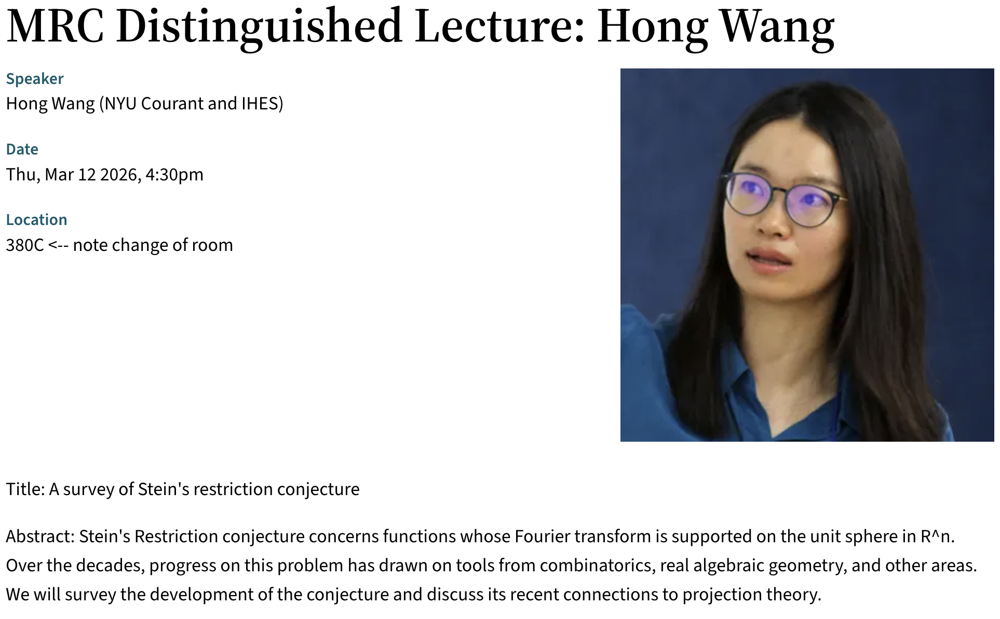
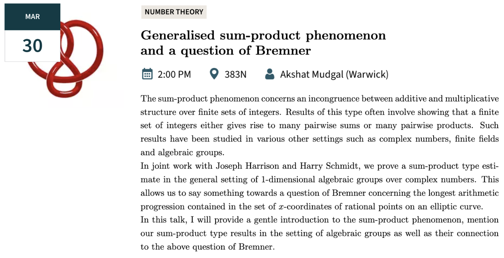
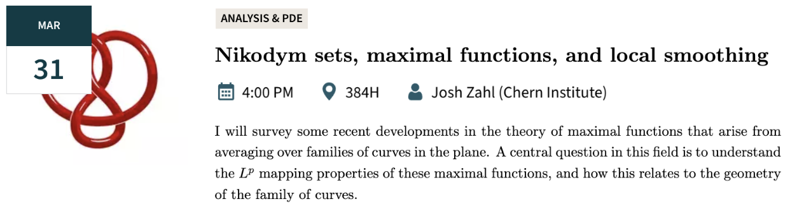
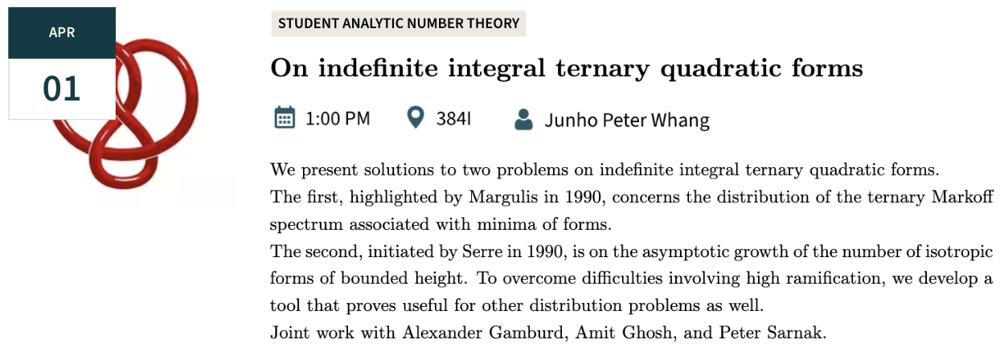
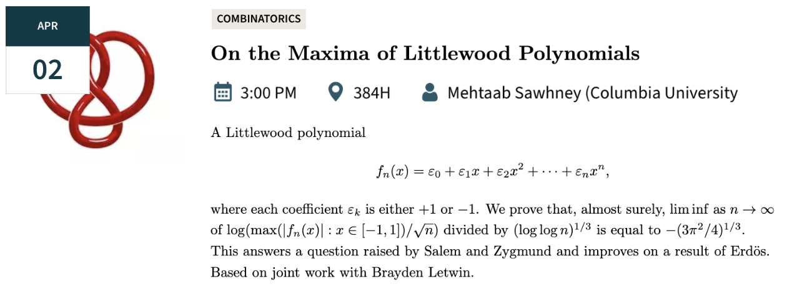

 
See [here](https://shihankanungo.github.io/math-talks-2025) for the talks I attended in 2025.

## Stanford University, Math Department Talks

### March

<ul>
<li>

  
<b>DEPARTMENT COLLOQUIUM &mdash; Hong Wang (NYU Courant and IHES)</b> 
    <i>MRC Distinguished Lecture: A survey of Stein's restriction conjecture</i>

  <small></small>

</li>
 </ul>

<ul>
<li>

  
<b>NUMBER THEORY &mdash; Akshat Mudgal (Warwick)</b> 
    <i>Generalised sum-product phenomenon and a question of Bremner</i>

  <small></small>

</li>
</ul>

<ul>
<li>

  
<b>ANALYSIS &amp; PDE &mdash; Josh Zahl (Chern Institute)</b> 
    <i>Nikodym sets, maximal functions, and local smoothing</i>

  <small></small>

</li>
</ul>

### April

<ul>
<li>

  
<b>STUDENT ANALYTIC NUMBER THEORY &mdash; Junho Peter Whang (Seoul National University)</b> 
    <i>On indefinite integral ternary quadratic forms</i>

  <small></small>

</li>
</ul>

<ul>
<li>

  
<b>COMBINATORICS &mdash; Mehtaab Sawhney (Columbia University; Open AI)</b> 
    <i>On the Maxima of Littlewood Polynomials</i>

  <small></small>

</li>
</ul>

