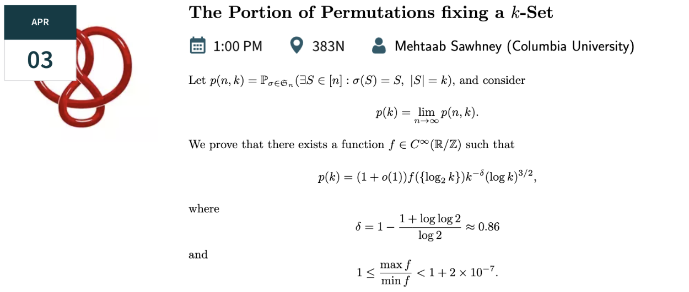
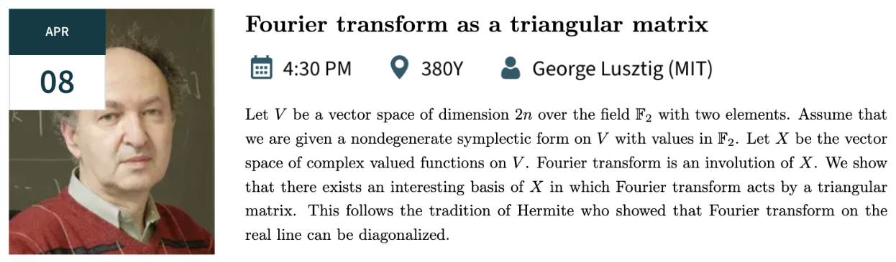
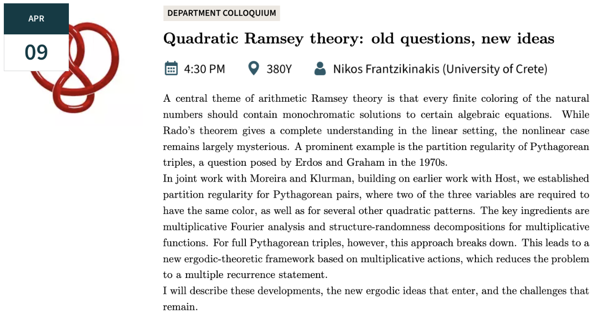
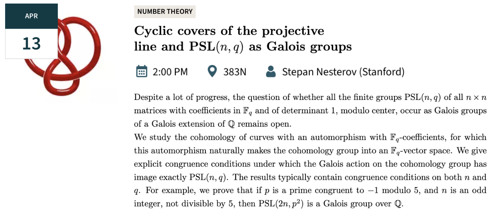
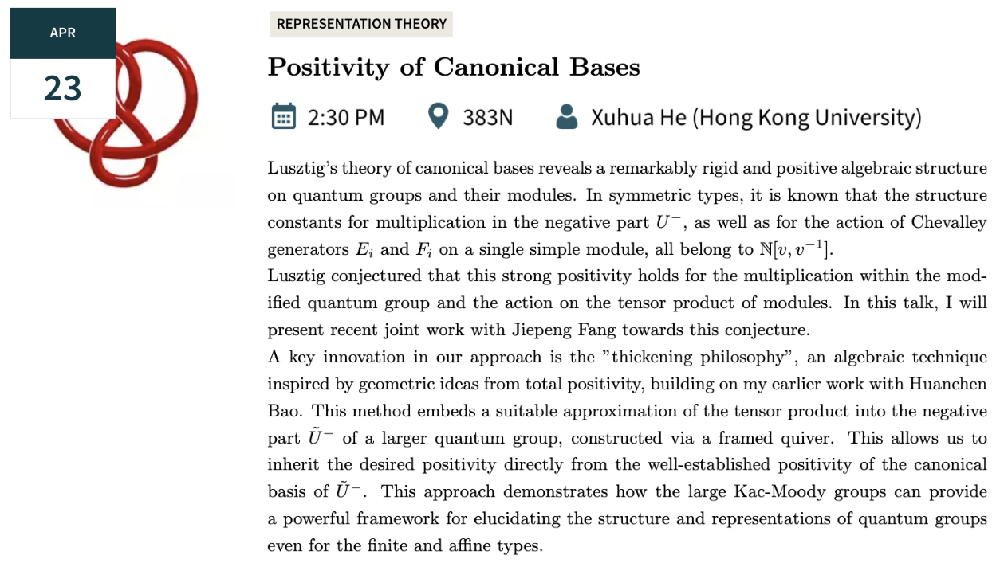
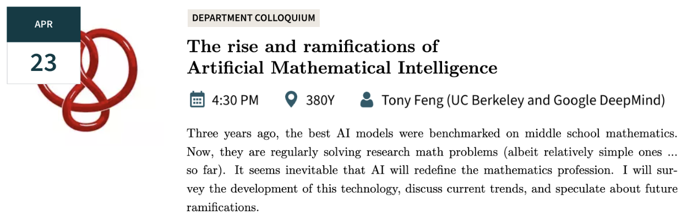

 
See [here](https://shihankanungo.github.io/math-talks-2025) for the talks I attended in 2025.

See [here](https://mathematics.stanford.edu/events/upcoming-events) for upcoming events at Stanford University, Department of Mathematics.

## Stanford University, Math Department Talks

### March

<ul>
<li>

  
<b>DEPARTMENT COLLOQUIUM &mdash; Hong Wang (NYU Courant and IHES)</b> 
    <i>MRC Distinguished Lecture: A survey of Stein's restriction conjecture</i>

  <small></small>

</li>
 </ul>

<ul>
<li>

  
<b>NUMBER THEORY &mdash; Akshat Mudgal (Warwick)</b> 
    <i>Generalised sum-product phenomenon and a question of Bremner</i>

  <small></small>

</li>
</ul>

<ul>
<li>

  
<b>ANALYSIS &amp; PDE &mdash; Josh Zahl (Chern Institute)</b> 
    <i>Nikodym sets, maximal functions, and local smoothing</i>

  <small></small>

</li>
</ul>

### April

<ul>
<li>

  
<b>STUDENT ANALYTIC NUMBER THEORY &mdash; Junho Peter Whang (Seoul National University)</b> 
    <i>On indefinite integral ternary quadratic forms</i>

  <small></small>

</li>
</ul>

<ul>
<li>

  
<b>COMBINATORICS &mdash; Mehtaab Sawhney (Columbia University; Open AI)</b> 
    <i>On the Maxima of Littlewood Polynomials</i>

  <small></small>

</li>
</ul>

<ul>
<li>

  
<b>COMBINATORICS &mdash; Mehtaab Sawhney (Columbia University; Open AI)</b> 
    <i>The Portion of Permutations fixing a k-Set</i>

  <small></small>

</li>
</ul>

<ul>
<li>

  
<b>REPRESENTATION THEORY &mdash; George Lusztig (MIT)</b> 
    <i>Fourier transform as a triangular matrix</i>

  <small></small>

</li>
</ul>

<ul>
<li>

  
<b>DEPARTMENT COLLOQUIUM &mdash; Nikos Frantzikinakis (University of Crete)</b> 
    <i>Quadratic Ramsey theory: old questions, new ideas</i>

  <small></small>

</li>
</ul>

<ul>
<li>

  
<b>NUMBER THEORY &mdash; Stepan Nesterov (Stanford)</b> 
    <i>Cyclic covers of the projective line and PSL(n,q) as Galois groups</i>

  <small></small>

</li>
</ul>

<ul>
<li>

  
<b>REPRESENTATION THEORY &mdash; Xuhua He (Hong Kong University)</b> 
    <i>Positivity of Canonical Bases</i>

  <small></small>

</li>
</ul>

<ul>
<li>

  
<b>DEPARTMENT COLLOQUIUM &mdash; Tony Feng (UC Berkeley; Google DeepMind)</b> 
    <i>The rise and ramifications of Artificial Mathematical Intelligence</i>

  <small></small>

</li>
</ul>
