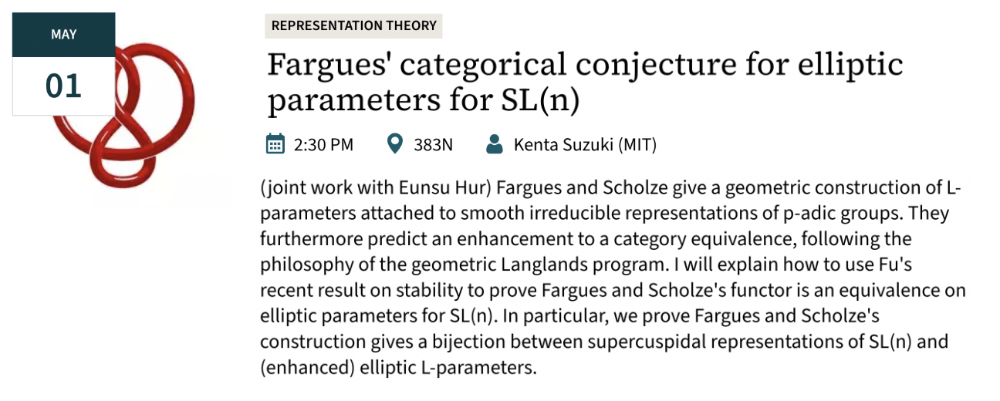
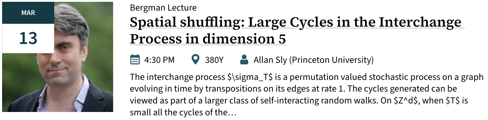

 

## Joint Mathematics Meeting '25. Seattle, WA Jan 7--11.
<small>The Joint Mathematics Meetings (JMM) is a mathematics conference hosted annually in early January by the American Mathematical Society (AMS). Frequently, several other national mathematics organizations also participate. The meeting is the largest gathering of mathematicians in the United States, and the largest annual meeting of mathematicians in the world. Several thousand talks, panels, minicourses, and poster sessions are held each year. This year I attended the following talks. </small>

### Invited Speakers

- **AMS Colloquium Lecture - Svetlana Jitomirskaya, UC, Berkeley**  
Part I. *Quantum mechanics meets arithmetics. The ten martini problem.*  
Part II. *Quantitative global theory, dual Lyapunov exponents, and robust spectral results.*  
Part III. *Small denominators without KAM. Robust arithmetic Spectral transitions.*  

- **von Neumann Lecture - Lester Mackey, Stanford University**  
*Stein's Method, Learning, and Inference*

- **AMS Erdős Lecture for Students - Kristin E. Lauter, Meta AI**  
*AI for Cryptography*

- **AMS Invited Address - Mohammed Abouzaid, Stanford University**  
_One Hundred Years of Morse Theory_

- **MAA-SIAM-AMS Hrabowski-Gates-Tapia-McBay Lecture - Victor Moll, Tulane Univ.**  
_Integral Tales: Some Unexpected Connections_

- **NAM Claytor-Woodard Lecture - Tai-Danae Bradley, SandboxAQ**  
_Structure in Language: A Category Theoretical Perspective_

- **JPBM Communications Award Lecture - Eugenia Cheng, Art Institute of Chicago**  
_Math, Art, Social Justice_

- **ASL Invited Address - Theodore Allen Slaman, University of California, Berkeley**  
_Extending Borel's Conjecture from Measure to Dimension_

### Special Sessions

- **AMS Special Session on New Trends in Lie Theory and Mathematical Physics**  
_Supersymmetric W-algebras and Free Field Realization_  
_Extending the Lax type operator for finite W-algebras_ 

- **AMS Special Session on Random Walks on Graphs and Related Parameters**  
_Some spectral properties of the non-backtracking matrix of a graph_   
_Defective eigenvalues of the non-backtracking matrix_   
_Multiphase Markov Chains_  
_On the last new vertex visited by a random walk in a directed graph_  
_Random walking on a graph and on its complement_ 

- **AMS Special Session on Extremal Combinatorics and Random Discrete Structures**  
_On Off-Diagonal F-Ramsey numbers_  
_On the number of P-free set families for tree posets P_  
_Extremal problems for given order and generalizations of independence numbers_  
_Gale duality in Hilbert spaces_

- **AMS Special Session on Local-to-Global in Apollonian Circle Packings and Beyond**  
_Spectral decomposition and Siegel-Veech transforms for strata: The case of marked tori_  
_Local obstructions in prime components of Apollonian circle packings_  
_Prime components in Apollonian circle packings_  
_Some perspectives on Local-Global problems_

- **AMS Current Events Bulletin**  
_Apollonian packings: the rise and fall of the local to global conjecture_  
_Floer cohomology and invariants of singularities_  
_Finding Arithmetic Progressions in Dense Sets of Integers_

## Stanford University, Math Department Talks

 

