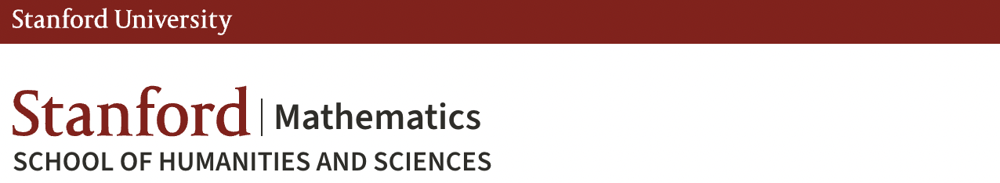

 
No talks attended yet in 2026!! Stay tuned. See [here](https://shihankanungo.github.io/math-talks-2025) for the talks I attended in 2025.

## Stanford University, Math Department Talks

### January

<ul>
<li>

  
<b>DEPARTMENT COLLOQUIUM &mdash; CF Gauss (Columbia)</b> 
    <i>State of the Art in Mathematics</i>

  <small></small>

</li>
 </ul>
