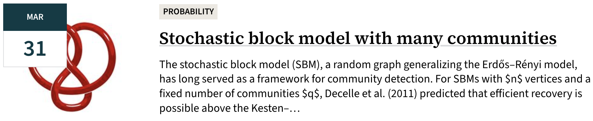

 

## Joint Mathematics Meeting '25. Seattle, WA Jan 7--11.
<small>The Joint Mathematics Meetings (JMM) is a mathematics conference hosted annually in early January by the American Mathematical Society (AMS). Frequently, several other national mathematics organizations also participate. The meeting is the largest gathering of mathematicians in the United States, and the largest annual meeting of mathematicians in the world. Several thousand talks, panels, minicourses, and poster sessions are held each year. This year I attended the following talks. </small>

### Invited Speakers

- **AMS Colloquium Lecture - Svetlana Jitomirskaya, UC, Berkeley**  
Part I. *Quantum mechanics meets arithmetics. The ten martini problem.*  
Part II. *Quantitative global theory, dual Lyapunov exponents, and robust spectral results.*  
Part III. *Small denominators without KAM. Robust arithmetic Spectral transitions.*  

- **von Neumann Lecture - Lester Mackey, Stanford University**  
*Stein's Method, Learning, and Inference*

- **AMS Erdős Lecture for Students - Kristin E. Lauter, Meta AI**  
*AI for Cryptography*

- **AMS Invited Address - Mohammed Abouzaid, Stanford University**  
_One Hundred Years of Morse Theory_

- **MAA-SIAM-AMS Hrabowski-Gates-Tapia-McBay Lecture - Victor Moll, Tulane Univ.**  
_Integral Tales: Some Unexpected Connections_

- **NAM Claytor-Woodard Lecture - Tai-Danae Bradley, SandboxAQ**  
_Structure in Language: A Category Theoretical Perspective_

- **JPBM Communications Award Lecture - Eugenia Cheng, Art Institute of Chicago**  
_Math, Art, Social Justice_

- **ASL Invited Address - Theodore Allen Slaman, University of California, Berkeley**  
_Extending Borel's Conjecture from Measure to Dimension_

### Special Sessions

- **AMS Special Session on New Trends in Lie Theory and Mathematical Physics**  
_Supersymmetric W-algebras and Free Field Realization_  
_Extending the Lax type operator for finite W-algebras_ 

- **AMS Special Session on Random Walks on Graphs and Related Parameters**  
_Some spectral properties of the non-backtracking matrix of a graph_   
_Defective eigenvalues of the non-backtracking matrix_   
_Multiphase Markov Chains_  
_On the last new vertex visited by a random walk in a directed graph_  
_Random walking on a graph and on its complement_ 

- **AMS Special Session on Extremal Combinatorics and Random Discrete Structures**  
_On Off-Diagonal F-Ramsey numbers_  
_On the number of P-free set families for tree posets P_  
_Extremal problems for given order and generalizations of independence numbers_  
_Gale duality in Hilbert spaces_

- **AMS Special Session on Local-to-Global in Apollonian Circle Packings and Beyond**  
_Spectral decomposition and Siegel-Veech transforms for strata: The case of marked tori_  
_Local obstructions in prime components of Apollonian circle packings_  
_Prime components in Apollonian circle packings_  
_Some perspectives on Local-Global problems_

- **AMS Current Events Bulletin**  
_Apollonian packings: the rise and fall of the local to global conjecture_  
_Floer cohomology and invariants of singularities_  
_Finding Arithmetic Progressions in Dense Sets of Integers_

## Stanford University, Math Department Talks

### June

  
<b>KIDDIE COLLOQUIUM &mdash; Milo Marsden (Stanford University)</b> &nbsp;&nbsp;
    <i>Eigenvalues of Wigner Matrices: A dip into Random Matrix Theory</i>

  <small></small>

  
<b>REPRESENTATION THEORY &mdash; Jeremy Taylor (UC Berkeley)</b> &nbsp;&nbsp;
    <i>The universal monodromic Bezrukavnikov equivalence</i>

  <small></small>

  
<b>DEPARTMENT COLLOQUIUM &mdash; Aravind Asok (USC)</b> &nbsp;&nbsp;
    <i>Constructing projective modules</i>

  <small></small>

  
<b>NUMBER THEORY &mdash; David Zywina (Cornell)</b> &nbsp;&nbsp;
    <i>There are infinitely many elliptic curves over the rationals of rank 2</i>

  <small></small>

  
<b>PROBABILITY &mdash; Chun Yin Siu (Stanford Psychiatry)</b> &nbsp;&nbsp;
    <i>Random topology: The topology of preferential attachment graphs</i>

  <small></small>

### May

  
<b>FACULTY AREA RESEARCH (FARS) &mdash; Jan Vondrak (Stanford)</b> &nbsp;&nbsp;
    <i>The "core" conjecture for approval-based elections</i>

  <small></small>

  
<b>COMBINATORICS &mdash; Richard Stanley (MIT & Miami)</b> &nbsp;&nbsp;
    <i>Some combinatorial applications of cyclotomic polynomials</i> 

  <small></small>

  
<b>DEPARTMENT COLLOQUIUM &mdash; Carlo Pagano (Concordia University)</b> &nbsp;&nbsp;
    <i>Hilbert's 10th problem via additive combinatorics</i>

  <small></small>

  
<b>ANALYTIC NUMBER THEORY &mdash; Carlo Pagano (Concordia University)</b> &nbsp;&nbsp;
    <i>2-descent in polynomial twist families</i>

  <small></small>

  
<b>TOPOLOGY &mdash; Scotty Tilton (UCSD)</b> &nbsp;&nbsp;
    <i>Exotic Diffeomorphisms: A Conversation Between Equivariant Stable Homotopy and Spin Four-Manifolds</i>

  <small></small>

  
<b>KIDDIE COLLOQUIUM &mdash; Shintaro Fushida-Hardy (Stanford)</b> &nbsp;&nbsp;
    <i>Introduction to Pencil Puzzles</i>

  <small></small>

  
<b>DEPARTMENT COLLOQUIUM &mdash; Joshua Zahl (UBC)</b> &nbsp;&nbsp;
    <i>The Kakeya set conjecture in three dimensions</i>

  <small></small>

  
<b>PROBABILITY &mdash; Zhenyuan Zhang (Stanford)</b> &nbsp;&nbsp;
    <i>On the first passage times of spatial branching processes</i>

  <small></small>

  
<b>NUMBER THEORY &mdash; Kiseok Yeon (UC Davis)</b> &nbsp;&nbsp;
    <i>On forms in many variables of different degrees</i>

  <small></small>

  
<b>KIDDIE COLLOQUIUM &mdash; Stepan Kazanin (Stanford)</b> &nbsp;&nbsp;
    <i>Classification Theorems</i>

  <small></small>

  
<b>DISTINGUISHED LECTURE &mdash; Martin Bridson (University of Oxford)</b> &nbsp;&nbsp;
    <i>Profinite rigidity: Chasing finite shadows of infinite groups through geometry</i>

  <small></small>

  
<b>NUMBER THEORY &mdash; Tongmu He (Princeton)</b> &nbsp;&nbsp;
    <i>Pointwise perfectoidness of Shimura varieties at infinite level</i>

  <small></small>

  
<b>PROBABILITY &mdash; Gabor Lugosi (Pompeu Fabra University)</b> &nbsp;&nbsp;
    <i>Paths and cliques in random temporal graphs</i>

  <small></small>

  
<b>KIDDIE COLLOQUIUM &mdash; Romain Speciel (Stanford)</b> &nbsp;&nbsp;
    <i>Quergodicity</i>

  <small></small>

  
<b>FACULTY AREA RESEARCH (FARS) &mdash; Sarah Peluse (Stanford)</b> &nbsp;&nbsp;
    <i>Finding multidimensional configurations in subsets of the integer grid</i>

  <small></small>

  
<b>ANALYTIC NUMBER THEORY &mdash; Jori Merikoski (Oxford)</b> &nbsp;&nbsp;
    <i>On primes represented by aX^2+bY^3</i>

  <small></small>

  
<b>NUMBER THEORY &mdash; Keerthi Madapusi (Boston College)</b> &nbsp;&nbsp;
    <i>A new approach to p-Hecke correspondences and Rapoport-Zink spaces</i>

  <small></small>

  
<b>REPRESENTATION THEORY &mdash; Kenta Suzuki (MIT)</b> &nbsp;&nbsp;
    <i>Fargues' categorical conjecture for elliptic parameters for SL(n)</i>

  <small></small>

### April

  
<b>ANALYSIS &mdash; Yuefong Song (Stanford)</b> &nbsp;&nbsp;
    <i>Fluids I</i>

  <small></small>

### March

  
<b>BERGMAN LECTURE &mdash; Allan Sly (Princeton)</b> &nbsp;&nbsp;
    <i>Stochastic Blocks Models: Detection and Recovery</i>

  <small></small>

  
<b>PROBABILITY &mdash; Youngtak Sohn (Brown)</b> &nbsp;&nbsp;
    <i>Stochastic block model with many communities</i>

  <small></small>

  
<b>BERGMAN LECTURE &mdash; Allan Sly (Princeton)</b> &nbsp;&nbsp;
    <i>Spatial shuffling: Large Cycles in the Interchange ​Process in dimension 5</i>

  <small></small>

  
<b>LECTURES &mdash; David Jerison (MIT)</b> &nbsp;&nbsp;
    <i>How Curved are Level Sets of Eigenfunctions?</i>

  <small></small>

### February

  
<b>DEPARTMENT COLLOQUIUM &mdash; Mehtaab Sawhney (Columbia)</b> &nbsp;&nbsp;
    <i>Improved Bounds for Szemerédi's Theorem</i>

  <small></small>

 

