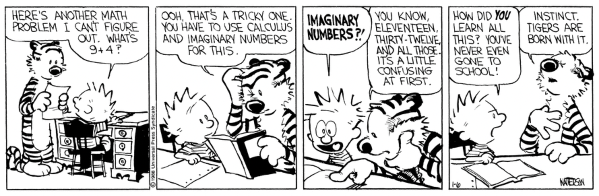

> “It is the time you have wasted for your rose that makes your rose so important.  
&mdash; Antoine de Saint-Exupéry, The Little Prince

 
I have a deep interest in the intricacies of numbers and patterns, and enjoy solving complex mathematical problems. I plan to major in math and do research in pure mathematics, with the long-term aim of being a professional mathematician. 

 
My mathematical journey has unfolded in three distinct chapters&mdash;each shaping how I think, explore, and learn.

### Chapter 1: Contests.
My early years were spent immersed in math contests&mdash;I began the AMC series in second grade, qualified for the AIME in fourth grade, and by age 12 had achieved a 
perfect score on the AMC 8 and qualified for the USAMO. That same year, I placed 4th nationally on Math Kangaroo Level 12, a competition intended for high school seniors.
It was an exciting time, filled with sharp puzzles and the joy of quick insight.

### Chapter 2: Research.
Around this time I became curious about what mathematics looked like beyond competitions. As a 12 year old freshman, I applied to the MIT PRIMES-USA program, where 
I’ve now spent three years researching topics in commutative algebra, representation theory, and combinatorics. I’ve co-authored four papers published in well-regarded journals, 
including one recognized with a USA Bronze Medal in Mathematics at the S.-T. Yau High School Science Awards. As a World Science Scholar (WSS ’24), I’ve had the chance to explore math and interdisciplinary science under the guidance of world-renowned researchers.

### Chapter 3: Balance.
As I turned 14, my passion for contests was rekindled through the Putnam Exam, a competition designed for undergraduates, which I took as a high school junior, placing 58th nationally among thousands of undergraduates&mdash;thereby earning an Honorable Mention. Getting back on the AMC track, I have recently won a USAMO Gold Award and attended the MAA’s Math Olympiad Program (MOP 2025). Meanwhile, I have continued my research and advanced coursework through San José State University, Euler Circle, and AoPS. 
 
Through  graduate-level applied mathematics courses at SJSU, I developed a fascination for physics, which led me to self-study college level physics. Subsequently, I became a USAPhO gold medalist and a member of the 2024 U.S. Physics Team. 
 
Today, I find meaning in both the elegance of contests and the depth of research&mdash;they challenge me in different ways, and together, they shape me into the mathematician I hope to become.

 
I am a 2023 Spirit of Ramanujan Fellow and a recipient of the 2025 Global Child Prodigy Award. 

