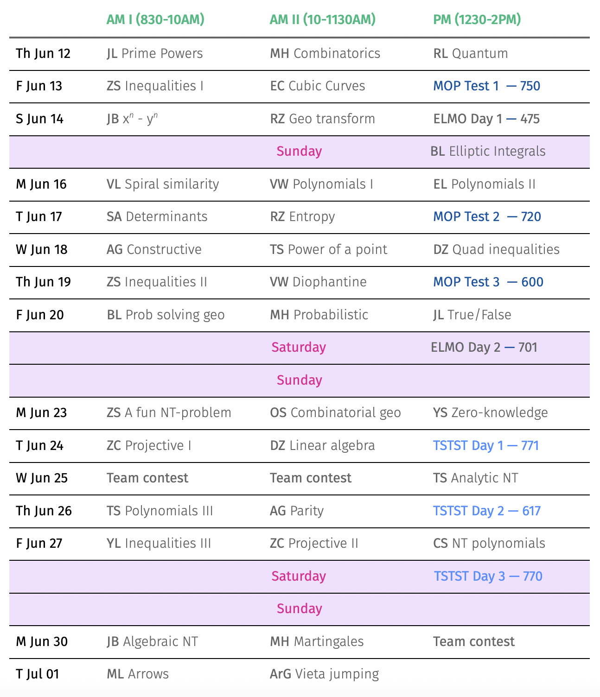

This year, MAA’s Mathematical Olympiad Program (MOP '25) is at the *Illinois Mathematics and Science Academy* (IMSA) from June 11--Jul 2, 2025.

## Table of contents
- [Table of contents](#table-of-contents)
- [Day 1](#day-1)
- [Day 5](#day-5)
- [The middle](#the-middle)
- [The end](#the-end)

Reached Chicago a few days early and stayed at *The Chicago Marriott Southwest at Burr Ridge* – fantastic hotel! Our room overlooked a beautiful view with a pond within a lush green rolling meadow. 

Dinner on Sunday was pizza at _Stix and Stones_ which was incredible.   On Monday I met with Isaac at Univ. of Chicago. 

In the evening, we had a fabulous dinner at _Kama Bistro_ --- black pepper lamb and achari chicken. I met with Arun on Tuesday at _Cupitol Coffee & Eatery_. We then had lunch at _Momo Factory_. Wednesday morning, mama and baba dropped me off at Terminal 2 of the Chicago O'Hare International Airport for the 1145AM shuttle to IMSA.

### Schedule of classes ("Blue" group)

## [Day 1](#day-1)

### Wednedsay, June 11, 2025.

A bunch of MOPpers started throwing olympiad problems at each other when we were roaming through the IMSA halls. It was quite fun!

The general community at MOP is quite friendly and inclusive. People play a lot of cards, and we also played pickleball.

Our rooms are pretty good; exactly like the pictures Hannah shared. We overlook a really nice view from the window. I’m sharing the room with Evan Fan, another junior. I like him quite a bit, and he reminds me of Allen Li from physics camp.

    Evan Fan &mdash; my roommate!  
 

Yoll is exactly like Jerry Guo, but nicer I think; he is also quite funny! I will be going for a run in the morning with Liam. 

I’m excited for MOP. I think that I will have a great time, and make a lot of friends.

## [Day 2](#day-2)

### Thursday, June 12, 2025.

We had our first MOP classes today: on prime powers and hidden graphs in combo problems. I enjoyed both of them, and what I really appreciated were the little insights that the instructors gave us while walking us through the solutions. I also presented my 17-page solution in MOP homework review.

MOP loves to play sports! I went for a run with Liam, Tiger, and Aryan in the morning. I think that this is going to be the running group. All four of us are serious. I also played basketball for an hour, and then played Frisbee for an hour. I played for 3 hours today ... would make Baba proud!

ELMO teams were decided; Jonathan told me I was in the first draft. 

    with Jonathan Du  

There are 7 teams in ELMO and they compete for the best score. Its a team captain format &mdash; each captain is one of the returners. I found out that I'm on team **Xooks** (captains: Calvin Wang and Oron Wang) and my team id is XOO7 ... so I guess that makes me James Bond!

I met Aryan Raj on the bus to IMSA. I like talking to him a lot; I think it is because we are on the same wavelength about many things.

I had a lot of fun at MOP today. Tomorrow is our first test. Time to lock in!

## [Day 3](#day-3)

### Friday, June 13, 2025.

The MOP classes today were both lecture-based: we had an inequalities class, which was just analysis and Lagrange multipliers, and a class on cubic curves which was very interesting, but I have no clue how to apply it. We also had our first MOP test, which I did reasonably well on (expecting 750). I spent a lot of time on P2 with a completely wrong idea but I ultimately figured it out. However I didn't have time to fully finish the writeup &mdash; I got to a point where the finish is quite easy. Also, my solution has a small (patchable) error.

We had a 2-Sigma dinner, where they gave a presentation and also got us free boba. The boba was good, but Arun’s explanation of what quants do was much better than the presentation.

Today I found out that Liam skipped two grades &mdash; just like me! He is a very nice person, and he cares about other people. He will always help you out if you ask him.

    with Liam Reddy and Aryan Raj  

ELMO is tomorrow. I’m feeling good about it &mdash; coming in strong after the MOP test. I will skip my run tomorrow&mdash;after all, it’s Saturday. I will also be doing my laundry.

## [Day 4](#day-4)

### Saturday, June 14, 2025.

Today was ELMO day 1. Dotted decided to troll us by making the ELMO as the “Error-Ridden Math Olympiad”, where all the problems were covered with random error messages and one of them was in Japanese. The ELSMO (which is supposed to be the troll version) was the “Elmo Loves Swapping Math Olympiads”, and was the actual test. I got P1 pretty quickly: it was an arrow problem. P2 was easy for me as well, mostly because I was able to reduce it to a problem from the Blue MOP combinatorics class (which I had solved). I then proceeded to spend 3 hours on P3, continually fakesolving and patching my solution until I finally got it. But right after the test, I realized that I got the wrong answer, and then someone pointed out that I misread the problem. It turns out that this happened to a bunch of people, and I was feeling very grumpy about that. But, in the evening, as Dotted was going through our team’s P3 submissions, he said that I should get a 4 or a 5 (which would be one of the top scores)! It turns out that my solution was on the right track, and most of it actually matched the official (correct) solution! So I’m feeling good now! Yay!

Oron is a very interesting character. Whenever he is working on a problem he starts randomly saying the words "Yay", "Spam", and "Buh". Someone said that MOP has a tradition of degen a few days ago. I think this is it.

    Oron Wang  
 

Today Grant Blitz and I were able to figure out who _quantumelectrodynamics_ (QED) was. A lot of people have been trying to find out, and yesterday Liam and Oron concluded that it was an alt account. At breakfast, Grant saw that QED was online, so I asked him to text QED "are u at breakfast?" to which QED replied "yes", so we immediately looked around to see who was on their phones. But then QED went offline, so we looked to see who had just put away their phone. There was one person who did: it was Dotted. We then sent him a few more texts, and the online/offline and typing patterns exactly matched! Dotted still won’t admit that he’s QED though.

Tomorrow is an off day: no classes or tests. It will be nice to relax and just hang out. 

## [Day 5](#day-5)

### Sunday, June 15, 2025.

Today was an off day: there were no classes (except for a seminar on elliptic integrals). But ELMO coordination was in full swing. Calvin spent 5 hours arguing with Liam about our team’s problem 1 submissions, and a good bit of that was on mine. They were debating whether to give a 4 or a 5. I felt that I should have got a 5, but due to the way that other peoples solutions were graded, we had to settle on a 4. But this caused me to decide to join in participating in writing the RELMO, and I’ve started working on a problem which imitates ELMO P2 and my p1 coordination, except in the problem I win.

I hang out with Jonathan quite a bit; we often sit together during MOP classes. He has an extremely good sense of humor and often makes very funny jokes. 

Today Jiahe organized a walk where a bunch of people went on an “excursion” to a place with a bunch of restaurants. I planned on going, but I was talking with Calvin about ELMO coordination when they left.

    Poker with a 7-2 hand.   From left to right: Daniel, Eden, Evan, and Grant  

I have made too many silly mistakes on the tests: 3 out of 5 problems I attempted. I think I need to sleep earlier so that I don’t get woken up by random noises, and I also need to be calmer during the tests.

## [Day 6](#day-6)

### Monday, June 16, 2025.

Today we had a class by Vivian Loh on spiral similarity! (Baba’s favorite subject). Then we had two consecutive classes on polynomials. The first one had a nerfed version of ELMO P3 on the first problem, and the second had Decartes’ Rule of Signs 💀. I also talked to Dotted about RELMO, and it turns out that we both ripped a problem from our PRIMES projects, and they are both about extremal functions.

Connor Leong is an excellent Frisbee player. After the ELMO, he said that my P3 submission was “brilliant” multiple times. Also, when we play Frisbee, if we are on opposite teams, he always guards me and if we are on the same team, he always dabs me up when we score a point. I think that he likes me a lot, and I like him too. He is part of the "cards group”, which also includes Vihaan, Rohan, David (who is probably the best at Frisbee), Ryan, and Kailua. I’ve started joining them for cards in the past few days.

Our second Assembly was today. We voted on the MOP t-shirt. There were 3 designs: one about a cross-section of a cube (which had nothing to do with the USAMO), one with the letters M,O,S,P in a grid, and one which had the words MOSP and YAY which looked like they were written with a computer mouse, and a graph symbolizing USAMO P2. I wanted the last one to win, but alas common sense prevailed and the first one won. 

Yesterday, I was able to get a sound sleep by wrapping a shirt around my eyes as an eye mask, and playing Max Richter “Sleep” on my earbuds. I think that I will do that for the rest of camp. Baba has also ordered an eye mask for me, which I will probably get tomorrow.

    Breakfast in the cafeteria.  

## [Day 7](#day-7)

### Tuesday, June 17, 2025.

MOP Test 2 was today. Problem 1 was an anti-problem!!!! I spent almost 3 hours on it, and I seriously thought that I was going to get swept. But I got it eventually. Unfortunately, I didn’t have time to solve P2, which was hard. I had all the right ideas though, and if I had more time I think I would have got it. It turns out that I was kind of right to be scared &mdash; Jonathan and Oron both got swept, and I am predicting 720. 

We had classes on determinants and entropy today; they were both interesting, although the problems felt a bit like AIME problems &mdash; i.e., computational.

I think Yoll Feng looks up to me; he has often expressed concern about the TSTST and asked me for advice. And today he asked me for some of my “orzness” before the test. I told him that he’d do fine.

Today was storytime; I had completely forgotten about it. I hadn’t checked my computer the whole day since I didn’t take it in my bag, so I didn’t see Baba’s message. I went after I called Baba and I saw the message, but it was too late. Hopefully, I will catch another one before MOP ends.

In this MOP test, I didn’t make any mistakes. However, I think that I might have spent a bit too much time on P1 going down a rabbit hole. I think that I should remember to stop and look for alternate approaches; I sometimes trust my intuition too much.

### Music

**Cosmic Ear: Traces** (2025, We Jazz) \[[Spotify](https://open.spotify.com/album/5w9BePfYZwwK2aaXq3HnJt?si=VkKfQ_4zRbyjpuH4Fodwpw)\]  New free jazz group, mostly well known Scandinavians remembering and revering Don Cherry: Christer Bothén (bass/contrabass clarinet, ngoni, piano); Mats Gustafsson (tenor sax, flutes, clarinets, electronics, organ, harmonica); Goran Kajfes (trumpets, electronics); Kansan Zetterberg (bass, ngoni); Juan Romero (percussion, berimbau, congas); with "special guest" Manane N Lemwo (kangnan). 

## [The middle](#the-middle)

Proin quis velit et eros auctor laoreet. Aenean eget nibh odio. Suspendisse mollis enim pretium, fermentum urna vitae, egestas purus. Donec convallis tincidunt purus, scelerisque fermentum eros sagittis vel. Aliquam ac aliquet risus, tempus iaculis est. Fusce molestie mauris non interdum hendrerit. Curabitur ullamcorper, eros vitae interdum volutpat, lacus magna lacinia turpis, at accumsan dui tortor vel lectus. Aenean risus massa, semper non lectus rutrum, facilisis imperdiet mi. Praesent sed quam quis purus auctor ornare et sed augue. Vestibulum non quam quis ligula luctus placerat sed sit amet erat. Vestibulum ante ipsum primis in faucibus orci luctus et ultrices posuere cubilia curae; Fusce auctor, sem eu volutpat dignissim, turpis nibh malesuada arcu, in consequat elit mauris quis sem. Nam tristique sit amet enim vel accumsan. Sed id nibh commodo, dictum sem id, semper quam.

## The end

Donec ex lectus, tempus non lacinia quis, pretium non ipsum. Praesent est nunc, rutrum vel tellus eu, tristique laoreet purus. In rutrum orci sit amet ex ornare, sit amet finibus lacus laoreet. Etiam ac facilisis purus, eget porttitor odio. Suspendisse tempus dolor nec risus sodales posuere. Proin dui dui, mollis a consectetur molestie, lobortis vitae tellus. Vivamus at purus sed urna sollicitudin mattis. Mauris lacinia libero in lobortis pulvinar. Nullam sit amet condimentum justo. Donec orci justo, pharetra ut dolor non, interdum finibus orci. Proin vitae ante a dui sodales commodo ac id elit. Nunc vel accumsan nunc, sit amet congue nunc. Aliquam in lacinia velit. Integer lobortis luctus eros, in fermentum metus aliquet a. Class aptent taciti sociosqu ad litora torquent per conubia nostra, per inceptos himenaeos.

