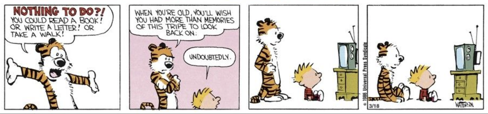
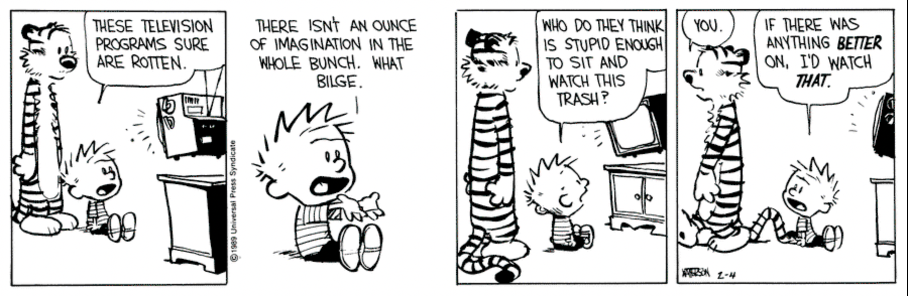

> "It's not what a movie is about, it's how it is about it." --- Roger Ebert 

 
I love watching movies, both in theaters (marked by 🎥 below), as well as at home &mdash; on Netflix, Prime Video, or on DVD. Yes, I still use DVDs. No, I will not be taking questions at this time.

Below is a lovingly curated list of movies I've watched *so far* this year&mdash;films I'd recommend to friends, strangers, time travelers, and probably even sworn enemies. If it’s listed here, it’s worth your time. If it’s marked with a 👍, it's a full-throated endorsement&mdash;like, stop-what-you're-doing-and-watch-it levels of enthusiasm. You're welcome in advance. Stay tuned for more!

 

- **Charlie Chaplin**  
  City Lights (1931 d. Charlie Chaplin)  
  Modern Times (1936 d. Charlie Chaplin)  
  The Great Dictator (1940 d. Charlie Chaplin)  👍
- Alice Doesn't Live Here Anymore (1974 d. Martin Scorsese)
- Top Gun (1986 d. Tony Scott)
- Forrest Gump (1994 d. Robert Zemeckis)
- Good Will Hunting (1997 d. Gus Van Sant)  👍
- A Beautiful Mind (2001 d. Ron Howard)
- Juno (2007 d. Jason Reitman)
- Easy A (2010 d. Will Gluck)
- Crazy Stupid Love (2011 d. Glenn Ficarra and John Requa)
- Zero Dark Thirty (2012 d. Kathryn Bigelow)
- The Imitation Game (2014 d. Morten Tyldum) 👍
- Love, Simon (2018 d. Greg Berlanti)
- Coda (2021 d. Sian Heder) 👍
- F1 (2025 d. Joseph Kosinski) 🎥 👍
- **Animation**  
  Kung Fu Panda (2008 d. John Stevenson and Mark Osborne)  
  Hundreds of Beavers (2022 d. Mike Cheslik) 👍   
  Robot Dreams (2024 d. Pablo Berger) 👍  
  Memoir of a Snail (2024 d. Adam Elliot)  
  Flow (2024 d. Gints Zilbalodis) 🎥
- **Wes Anderson**  
  Rushmore (1998 d. Wes Anderson)  
  Fantastic Mr. Fox (2009 d. Wes Anderson)  
  Moonrise Kingdom (2012 d. Wes Anderson)  
  The Grand Budapest Hotel (2014 d. Wes Anderson) 👍  
  The Wonderful Story of Henry Sugar (2023 d. Wes Anderson)  
- **Wallace & Gromit**  
  A Grand Day Out With Wallace and Gromit (1989 d. Nick Park)  
  The Curse of the Were-Rabbit (2005 d. Nick Park, Steve Box)  
  Vengeance Most Fowl (2024 d. Nick Park, Merlin Crossingham)
- **George Paul Csicsery**  
  Hard Problems: The Road to the World's Toughest Math Contest (2008)  
  Secrets of the Surface: The Mathematical Vision of Maryam Mirzakhani (2020)
- **The Hunger Games**  
  The Hunger Games (2012 d. Gary Ross)  
  The Hunger Games: Catching Fire (2013 d. Francis Lawrence)  
  The Hunger Games: Mockingjay – Part 1 (2014 d. Francis Lawrence)  
  The Hunger Games: Mockingjay – Part 2 (2015 d. Francis Lawrence)
- **Music documentaries**  
  Miss Americana (2020 d. Lana Wilson)  
  Becoming Led Zeppelin (2025 d. Bernard MacMahon)  
  Pink Floyd at Pompeii – MCMLXXII (2025 d. Adrian Maben) 🎥  
  We Want The Funk! (2025 d. Stanley Nelson and Nicole London) 👍   <small>_PBS Independent Lens documentary_</small>
