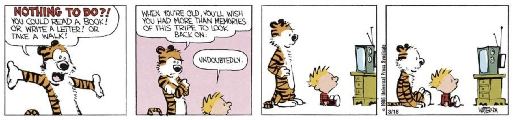
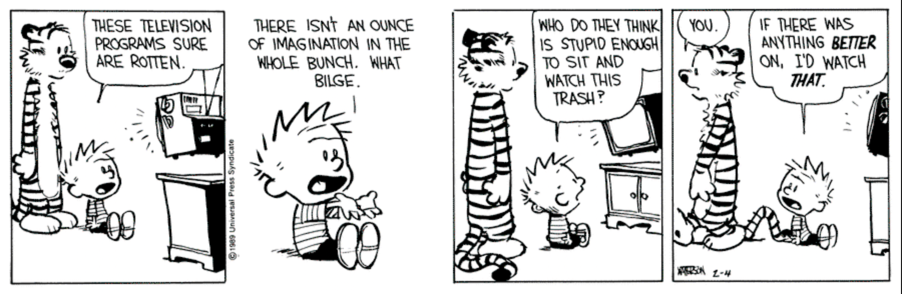

> "It's not what a movie is about, it's how it is about it." --- Roger Ebert 

 
I love watching movies, both in theaters (marked by 🎥 below), as well as at home &mdash; on Netflix, Prime Video, or on DVD. Yes, I still use DVDs. No, I will not be taking questions at this time.

See [here](https://shihankanungo.github.io/wrapped-2025#movies) for the movies I watched in 2025.

Below is a lovingly curated list of 14 movies I've watched *so far* this year&mdash;films I'd recommend to friends, strangers, time travelers, and probably even sworn enemies. If it’s listed here, it’s worth your time. If it’s marked with a 👍, it's a full-throated endorsement&mdash;like, stop-what-you're-doing-and-watch-it levels of enthusiasm. You're welcome in advance. Stay tuned for more!

- The Godfather (1972 d. Francis Ford Coppola) 👍
- The Godfather Part II (1974 d. Francis Ford Coppola) 👍
- Raging Bull (1980 d. Martin Scorsese)
- Before Sunrise (1995 d. Richard Linklater)
- Before Sunset (2004 d. Richard Linklater)
- Spy Game (2001 d. Tony Scott) 👍
- **The Lord of the Rings, 2026 Extended Edition**  
  The Fellowship of the Ring (2001 d. Peter Jackson) 🎥 👍  
  The Two Towers (2002 d. Peter Jackson) 🎥 👍  
  The Return of the King (2003 d. Peter Jackson) 🎥 👍
- The Prestige (2006 d. Christopher Nolan) 👍
- Zodiac (2007 d. David Fincher)
- The Spectacular Now (2013 d. James Ponsoldt)
- In Your Dreams (2025 d. Alex Woo, Erik Benson)
- Frankenstein (2025 d. Guillermo del Toro) 

This is my current wishlist:

- 1993: Schindler's List (d. Steven Spielberg) 3h 15m
- 1994: Pulp Fiction (d. Quentin Tarantino) 2h 34m
- 1995: Maborosi (d. Hirokazu Kore-eda) 1h 35m
- 1996: Fargo (d. Joel Coen) 1h 38m
- 1997: Princess Mononoke (d. Hayao Miyazaki) 2h 14m
- 1997: Donnie Brasco (d. Mike Newell) 2h 7m
- 1997: L.A. Confidential (d. Curtis Hanson) 2h 18m
- 1997: Jackie Brown (d. Quentin Tarantino) 2h 34m
- 1997: Titanic (d. James Cameron) 3h 14m
- 1997: Kundun (d. Martin Scorsese) 2h 20m
- 1998: Elizabeth (d. Shekhar Kapur) 2h 4m
- 1998: Pleasantville (d. Gary Ross) 2h 4m
- 1998: Life Is Beautiful (d. Roberto Benigni) 1h 56m
- 1998: Saving Private Ryan (d. Steven Spielberg) 2h 49m
- 1998: The Truman Show (d. Peter Weir) 1h 43m
- 1999: Being John Malkovich (d. Spike Jonze) 1h 53m
- 1999: The Insider (d. Michael Mann) 2h 37m
- 2004: Eternal Sunshine of the Spotless Mind (d. Michel Gondry) 1h 48m
- 2008: The Hurt Locker (d. Kathryn Bigelow) 2h 11m
- 2011: A Separation (d. Asghar Farhadi) 2h 3m
- 2014: Boyhood (d. Richard Linklater) 2h 45m
- 2018: Roma (d. Alfonso Cuarón) 2h 15m
- 2019: They Shall Not Grow Old (d. Peter Jackson) 1h 39m

Movies with a vibe like that of *Zodiac* &mdash; psychological, meticulous, a little obsessive, often with a cat-and-mouse dynamic or fractured perception of truth.

- 1986: Manhunter (d. Michael Mann) 2h
- 1995: Se7en (d. David Fincher) 2h 10m
- 1999: The Bone Collector (d. Phillip Noyce) 1h 58m
- 2001: Frailty (d. Bill Paxton) 1h 40m
- 2002: Insomnia (d. Christopher Nolan) 1h 58m
- 2003: Mystic River (d. Clint Eastwood) 2h 17m
- 2010: Shutter Island (d. Martin Scorsese) 2h 18m
- 2013: Prisoners (d. Denis Villeneuve) 2h 33m
- 2014: Nightcrawler (d. Dan Gilroy) 1h 57m
- 2017: Wind River (d. Taylor Sheridan) 1h 47m
