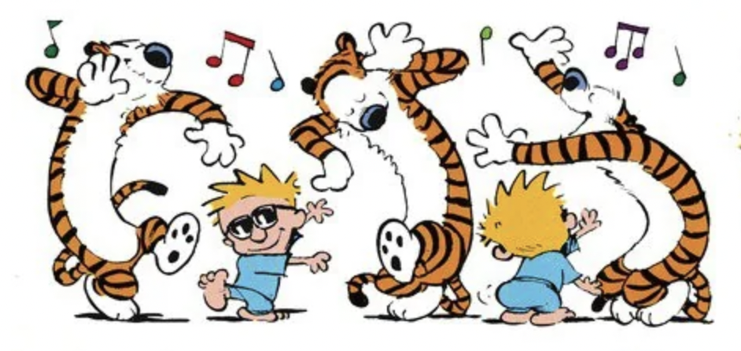

> "People haven't always been there for me but music always has." --- Taylor Swift

 

### Live Concerts

### Recorded Music

At the start of the year, I had the noble idea of tracking every piece of music I listened to&mdash;like some kind of sonic librarian. It took approximately five minutes to realize this was a fool’s errand. Case in point: last year alone, I clocked 9,860 songs and over 100,000 minutes on Spotify. 

And that’s _just_ Spotify. Throw in CDs, YouTube rabbit holes, car rides, and my Bandcamp jazz benders, and suddenly it looks like I'm trying to inventory Niagara Falls with a teaspoon.

So, after a few weeks of valiant effort (and mild spreadsheet trauma), I threw in the towel. Going forward, I’ll just note the highlights: music that has sounded remarkable to me for one reason or another; songs that made me pause, perk up, or transported me to a strange, weird, fascinating world.

  

