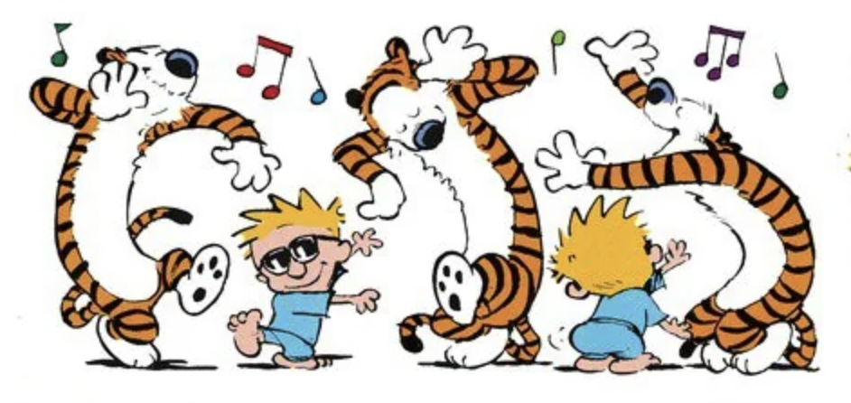

> "People haven't always been there for me but music always has." --- Taylor Swift

 

### Live Concerts

<ul>
 <li>

  
 <i>Courtney Barnett: Creature of Habit Tour</i>. The Fillmore, San Francisco, California, on Wednesday, August 26, 2026. 

  <small>This set list from the Wed, Aug 26 concert at The Fillmore [<a href="https://open.spotify.com/playlist/0OuX6f5DtJvdJ5mlNUvvcH?si=2578be25acde4b30">Spotify</a>] </small>
</li>
</ul>

<iframe data-testid="embed-iframe" style="border-radius:12px" src="https://open.spotify.com/embed/playlist/0OuX6f5DtJvdJ5mlNUvvcH?utm_source=generator&si=9ccb3006cbfb466e" width="100%" height="352" frameBorder="0" allowfullscreen="" allow="autoplay; clipboard-write; encrypted-media; fullscreen; picture-in-picture" loading="lazy"></iframe>

### Recorded Music

Check out these playlists (in progress), with one song each from my favorite albums from 2026: <a href="https://open.spotify.com/playlist/08IgHzhli2cL1F04arxSXP?si=3da645526af14d50&pt=0634245d89226d227a5223181106540d">pop</a> and <a href="https://open.spotify.com/playlist/3hxuITtg6yfDcN3DEfD0J0?si=07dee6817bfc46f8&pt=d17b00f61de8f43dcadb16299042cc6d">jazz</a>.  
<iframe data-testid="embed-iframe" style="border-radius:12px" src="https://open.spotify.com/embed/playlist/08IgHzhli2cL1F04arxSXP?utm_source=generator" width="100%" height="152" frameBorder="0" allowfullscreen="" allow="autoplay; clipboard-write; encrypted-media; fullscreen; picture-in-picture" loading="lazy"></iframe> 
<iframe data-testid="embed-iframe" style="border-radius:12px" src="https://open.spotify.com/embed/playlist/3hxuITtg6yfDcN3DEfD0J0?utm_source=generator" width="100%" height="152" frameBorder="0" allowfullscreen="" allow="autoplay; clipboard-write; encrypted-media; fullscreen; picture-in-picture" loading="lazy"></iframe>  

At the start of the year, I had the noble idea of tracking every piece of music I listened to&mdash;like some kind of sonic librarian. It took approximately five minutes to realize this was a fool’s errand. Case in point: last year alone, I clocked 17,748 songs and over 150,000 minutes on Spotify. 

And that’s _just_ Spotify. Throw in CDs, YouTube rabbit holes, car rides, and my Bandcamp jazz benders, and suddenly it looks like I'm trying to inventory Niagara Falls with a teaspoon.

So, after a few weeks of valiant effort (and mild spreadsheet trauma), I threw in the towel. Going forward, I’ll just note the highlights: music that has sounded remarkable to me for one reason or another; songs that made me pause, perk up, or transported me to a strange, weird, fascinating world.

Meanwhile, here's my top 20 artists on Spotify for the 138 days between Apr 5--Aug 22.

... and here's my top 20 artists on Spotify for the 7 day period, Aug 15--22.

  

