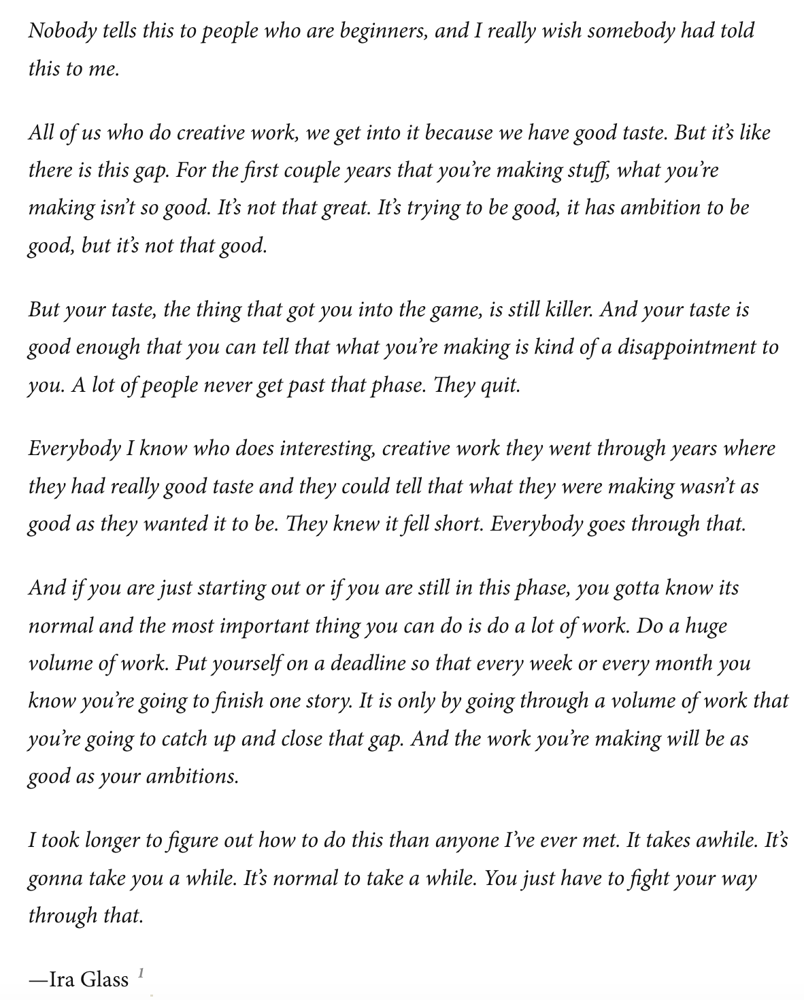

 

When you're not being productive in a meaningful way, take a page from Cal Newport’s concept of “deep work.” Newport emphasizes the importance of sustained, undistracted focus on cognitively demanding tasks, helping ensure depth and mastery rather than superficial exploration. As Newport explains, 
> “In order for a session to count as deep work there must be zero distractions. Even a quick glance at your phone or email inbox can significantly reduce your performance due to the cost of context switching.”

When I’m learning about a new subject, for example, I set a timer, silence my devices and notifications, and aim to get into a state of flow. I try to immerse myself in the topic and let distractions and concerns fade into the background. Best case scenario? I lose track of time until the alarm pulls me back. After several focused learning sprints, however, I start to notice diminishing returns—my thoughts feel slower, and my brain begins to feel saturated. That’s when it’s time to switch gears and tackle a different task.

### David Nicholls on "education"

I want to be able to listen to recording of piano sonatas and know who's playing. I want to go to classical concerts and know when you're meant to clap. I want to be able to 'get' modern jazz without it all sounding like this terrible mistake, and I want to know who the Velvet Underground are exactly. I want to be fully engaged in the World of Ideas, I want to understand complex economics, and what people see in Bob Dylan. I want to possess radical but humane and well-informed political ideals, and I want to hold passionate but reasoned debates round wooden kitchen tables, saying things like 'define your terms!' and 'your premise is patently specious!' and then suddenly to discover that the sun's come up and we've been talking all night. I want to use words like 'eponymous' and 'solipsistic' and 'utilitarian' with confidence. I want to learn to appreciate fine wines, and exotic liquers, and fine single malts, and learn how to drink them without turning into a complete div, and to eat strange and exotic foods, plovers' eggs and lobster thermidor, things that sound barely edible, or that I can't pronounce...Most of all I want to read books; books thick as brick, leather-bound books with incredibly thin paper and those purple ribbons to mark where you left off; cheap, dusty, second-hand books of collected verse, incredibly expensive, imported books of incomprehensible essays from foregin universities.   At some point I'd like to have an original idea...And all of these are the things that a university education's going to give me.   --- David Nicholls, <i>Starter for Ten</i>

### Ira Glass describes his long struggle to create something noteworthy

Nobody tells this to people who are beginners, and I really wish somebody had told this to me.

All of us who do creative work, we get into it because we have good taste. But it’s like there is this gap. For the first couple years that you’re making stuff, what you’re making isn’t so good. It’s not that great. It’s trying to be good, it has ambition to be good, but it’s not that good.

But your taste, the thing that got you into the game, is still killer. And your taste is good enough that you can tell that what you’re making is kind of a disappointment to you. A lot of people never get past that phase. They quit.

Everybody I know who does interesting, creative work they went through years where they had really good taste and they could tell that what they were making wasn’t as good as they wanted it to be. They knew it fell short. Everybody goes through that.

And if you are just starting out or if you are still in this phase, you gotta know its normal and the most important thing you can do is do a lot of work. Do a huge volume of work. Put yourself on a deadline so that every week or every month you know you’re going to finish one story. It is only by going through a volume of work that you’re going to catch up and close that gap. And the work you’re making will be as good as your ambitions.

I took longer to figure out how to do this than anyone I’ve ever met. It takes awhile. It’s gonna take you a while. It’s normal to take a while. You just have to fight your way through that.

—Ira Glass

"When you live on your own for a long time, however, your personality changes because you go so much into yourself you lose the ability to be social, to understand what is and isn't normal behavior. There is an entire world inside yourself, and if you let yourself, you can get so deep inside it you will forget the way to the surface. Other people keep our souls alive, just like food and water does with our body."   --- Donald Miller, <i>Blue Like Jazz: Nonreligious Thoughts on Christian Spirituality</i>

"The most beautiful people we have known are those who have known defeat, known suffering, known struggle, known loss, and have found their way out of the depths. These persons have an appreciation, a sensitivity, and an understanding of life that fills them with compassion, gentleness, and a deep loving concern. Beautiful people do not just happen."   --- Elisabeth Kübler-Ross

"He smiled understandingly-much more than understandingly. It was one of those rare smiles with a quality of eternal reassurance in it, that you may come across four or five times in life. It faced--or seemed to face--the whole eternal world for an instant, and then concentrated on you with an irresistible prejudice in your favor. It understood you just as far as you wanted to be understood, believed in you as you would like to believe in yourself, and assured you that it had precisely the impression of you that, at your best, you hoped to convey."   --- F. Scott Fitzgerald, <i>The Great Gatsby</i>

"I saw my life branching out before me like the green fig tree in the story. From the tip of every branch, like a fat purple fig, a wonderful future beckoned and winked. One fig was a husband and a happy home and children, and another fig was a famous poet and another fig was a brilliant professor, and another fig was Ee Gee, the amazing editor, and another fig was Europe and Africa and South America, and another fig was Constantin and Socrates and Attila and a pack of other lovers with queer names and offbeat professions, and another fig was an Olympic lady crew champion, and beyond and above these figs were many more figs I couldn’t quite make out. I saw myself sitting in the crotch of this fig tree, starving to death, just because I couldn’t make up my mind which of the figs I would choose. I wanted each and every one of them, but choosing one meant losing all the rest, and, as I sat there, unable to decide, the figs began to wrinkle and go black, and, one by one, they plopped to the ground at my feet."  
--- Sylvia Plath, The Bell Jar

"The blues is an impulse to keep the painful details and episodes of a brutal experience alive in one's aching consciousness, to finger its jagged grain, and to transcend it, not by the consolation of philosophy but by squeezing from it a near-tragic, near-comic lyricism. As a form, the blues is an autobiographical chronicle of personal catastrophe expressed lyrically."   --- Ralph Ellison, <i>Living with Music: Jazz Writings</i>

"It’s not the note you play that’s the wrong note – it’s the note you play afterwards that makes it right or wrong." --- Miles Davis

"There will come a time when you believe everything is finished; that will be the beginning."   --- Louis L'Amour

"If you're trying to choose between two theories and one gives you an excuse for being lazy, the other one is probably right." --- Paul Graham, <i>What You'll Wish You'd Known</i>

"It's dangerous to design your life around getting into college, because the people you have to impress to get into college are not a very discerning audience. At most colleges, it's not the professors who decide whether you get in, but admissions officers, and they are nowhere near as smart. They're the NCOs of the intellectual world. They can't tell how smart you are. The mere existence of prep schools is proof of that."   --- Paul Graham, <i>What You'll Wish You'd Known</i>

"No art, however minor, demands less than total dedication if you want to excel in it."   --- Leon Battista Alberti

"The word I most misunderstood was "tact." As used by adults, it seemed to mean keeping your mouth shut. I assumed it was derived from the same root as "tacit" and "taciturn," and that it literally meant being quiet. I vowed that I would never be tactful; they were never going to shut me up. In fact, it's derived from the same root as "tactile," and what it means is to have a deft touch. Tactful is the opposite of clumsy. I don't think I learned this until college.   
--- Paul Graham, <i>Why Nerds are Unpopular</i>

"Tact is the ability to tell someone to go to hell in such a way that they look forward to the trip." --- Winston Churchill

"Pain and suffering are always inevitable for a large intelligence and a deep heart. The really great men must, I think, have great sadness on earth."   --- Fyodor Dostoevsky, <i>Crime and Punishment</i>

"I have a theory that selflessness and bravery aren't all that different."   --- Veronica Roth, <i>Divergent</i>

"Everything that irritates us about others can lead us to an understanding of ourselves."   --- Carl Gustav Jung

"If you hate a person, you hate something in him that is part of yourself. What isn't part of ourselves doesn't disturb us." --- Hermann Hesse, <i>Demian</i>

"Vanity and pride are different things, though the words are often used synonymously. A person may be proud without being vain. Pride relates more to our opinion of ourselves, vanity to what we would have others think of us." --- Jane Austen, <i>Pride and Prejudice</i>

"It is not the critic who counts; not the man who points out how the strong man stumbles, or where the doer of deeds could have done them better. The credit belongs to the man who is actually in the arena, whose face is marred by dust and sweat and blood; who strives valiantly; who errs, who comes short again and again, because there is no effort without error and shortcoming; but who does actually strive to do the deeds; who knows great enthusiasms, the great devotions; who spends himself in a worthy cause; who at the best knows in the end the triumph of high achievement, and who at the worst, if he fails, at least fails while daring greatly, so that his place shall never be with those cold and timid souls who neither know victory nor defeat." --- Theodore Roosevelt

"A human being is a part of the whole called by us universe, a part limited in time and space. He experiences himself, his thoughts and feeling as something separated from the rest, a kind of optical delusion of his consciousness. This delusion is a kind of prison for us, restricting us to our personal desires and to affection for a few persons nearest to us. Our task must be to free ourselves from this prison by widening our circle of compassion to embrace all living creatures and the whole of nature in its beauty." --- Albert Einstein

"It is the time you have wasted for your rose that makes your rose so important.   --- Antoine de Saint-Exupéry, <i>The Little Prince</i>

"Weeds are flowers, too, once you get to know them." --- A.A. Milne

"The measure of intelligence is the ability to change." --- Albert Einstein

"Compassion is the basis of morality." --- Arthur Schopenhauer

"The longer and more carefully we look at a funny story, the sadder it becomes."   --- Nikolai V. Gogol

   

