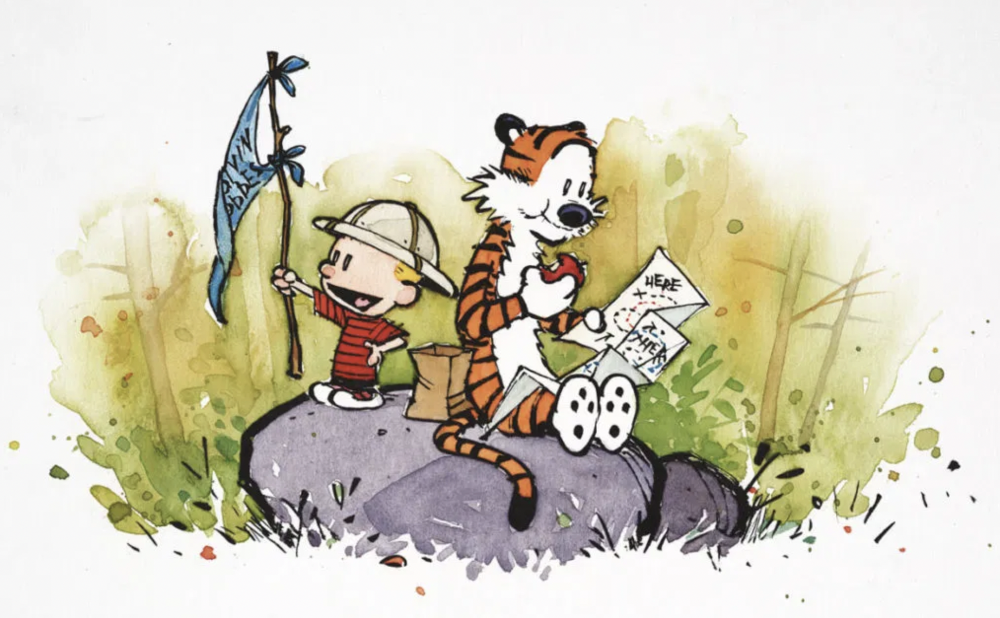

> "Not all those who wander are lost." --- J.R.R. Tolkien, The Fellowship of the Ring

- **Seattle, WA --- Jan 7--11**. Joint Mathematics Meeting (JMM25). Got to hang out with SE; food was beyond amazing --- Halal Smash'd Burgers, Moroccan lamb roll, curry beef hom bao, dinner at *Zaika* with SE and family.
- **Pasadena, CA --- Jan 24--26**. Caltech Math Meet (CMM). Road trip with dad. Had *Din Tai Fung* for both dinners. Highlight: listening to music on the drive to and from. It was snowing near LA on the way back!!
- **Cambridge, MA --- Feb 14--16**. Harvard-MIT Math Tournament (HMMT Feb). Got to hang out with WZ; dinner from *Himalayan Kitchen* on Fri; "*Ghana Bitter*" from Royce chocolates on Sat. Several inches of snow coated the streets from a storm Saturday night into Sunday morning.
- **San Francisco, CA --- Feb 22**. *Strings for Peace*. Ustad Amjad Ali Khan & Sharon Isbin. Dinner at *Mochica Peruvian* followed by hangout at the corner bookstore. Concert at Herbst Theater from 730PM--10PM. It was fantastic!
- **San Francisco, CA --- Mar 15**. To celebrate adMIT. Lunch at *La Mar* (empanadas, inca cola, lomo saltado) followed by _Ferry Building_ (s'more, blondie). Baba got me a *Dandelion chocolate, 85% dark*.
- **London, UK --- Apr 15--23**. To commemorate Project PickAxe (those who know!). Great food scene -- _Oorja_, and momos at _Darjeeling Express_. Walking around the city is fun! We saw Buckingham Palace and explored parts of Soho. The Cotswolds are magical---we had a great time there. Coming back to London, we took a boat ride, visited the _National Gallery_, and explored more of the city on foot.
- **San Francisco, CA --- May 24**. Lunch at *Papito* (steak fajitas) followed by a walk down the street and browsing in the corner bookstore, where I read the first few pages of *Mistborn* by Brandon Sanderson. We also stopped by the local convenience store and Baba and I picked up a "*La Fermière Naturally French Creamy Whole Milk Rose Yogurt*" each.  
- **Chicago, IL --- Jun 8--10**. Stayed at *Chicago Marriott Southwest at Burr Ridge* -- fantastic hotel! Our room overlooks a beautiful view with a pond within a lush green rolling meadow. Pizzas at _Stix and Stones_ were incredible. On Monday I met with Isaac at Univ. of Chicago. We also had a fabulous dinner at *Kama Bistro* -- black pepper lamb and achari chicken. I met with Arun on Tuesday at *Cupitol Coffee & Eatery*. We then had lunch at *Momo Factory*.
- **IMSA, Aurora, IL --- Jun 11--Jul 2**. MAA's Mathematical Olympiad Program (MOP) at the *Illinois Mathematics and Science Academy* (IMSA). 
- **Danville, CA --- Jul 5**. To meet with **WZ** at Blackhawk Plaza.
- **Guerneville, CA --- Aug 4--8**. The drive took us 3 hours, during which we mostly listened to Taylor Swift, Miranda Lambert and dad's interstate playlist. Mom had some *interesting* questions for us, and we chatted a fair bit as well. Stayed at *The Stavrand Russian River Valley*, which served complimentary breakfast which was amazing &mdash; dad and I ordered *chilaquiles*, while mom went with the *eggs benedict*. 
- **Sacramento, CA --- Aug 8--9**. For the MAA AMC Award Ceremony at the *SAFE Credit Union Convention Center*. Honorees include the 2025 U.S. IMO and EGMO teams, the USAMO Gold winners, the Young Women in Mathematics, and the 2024 Edyth May Sliffe Award winners. MAA put us up at the *Sheraton Grand Sacramento Hotel*. We had dinner at *Zocalo's Midtown* &mdash; enchiladas for me, tacos for dad, and salmon for mom. The food was excellent and the service was beyond excellent. They even brought us a complimentary dessert at the end of the meal. Next day, mom went out and stumbled upon the Farmer's Market, which she raved about for the rest of the trip and even after reaching home. The awards ceremony was excellent: the speeches were very good, particularly Prof. Tao's keynote address, and it was all arranged very professionally. At Mathfest, me and the other awardees were treated very specially: many people came up and introduced themselves to us. I chatted with **TZ** for a long-ish time. Persi Diaconis gave an interesting (and fun) talk on card tricks.
- **New York City, NY --- Sep 18--20**. Jane Street Celebration of Mathematics. JS put us up at the Marriott in Downtown NYC. There is a cool cafe nearby -- NYC Regular. Hung out with TZ both days (like a lot!); it was so much fun!! Jane Street office is cool -- the NYC office is the first and largest of their offices; it is in the heart of the Financial District, with views of the Hudson River and the Statue of Liberty. We listened to some recruiting speeches and played a few games. Got a lot of swags -- a Sonos Roam speaker, t-shirts, Figgie. Went for dinner to *Oyster Bar* and then hung out for a bit by the water. I was so excited that I went to sleep waaayy past my usual bedtime on Friday night (actually technically Saturday morning).
- **San Francisco, CA --- Oct 12**. Dua Lipa: *Radical Optimism Tour* at Chase Center, SF. Reached *Papito* at 515PM for an early-ish dinner. Ordered steak fajitas (of course) with their habanero sauce on the side. Excellent, as usual!! Reached Chase Center at 6PM. Doors opened at 630PM, CiL came on at 730PM, and the main show started 9PM, with a breathtaking entrance &mdash; "quite possibly the greatest stage entrance ever: Dua Lipa sets San Francisco on fire" (according to one headline). Encore ended at 11PM.
<ul><li style="list-style-type: none;">

  
 Set list from the concert in Chase Center on Sunday, October 12, 2025. [<a href="https://open.spotify.com/playlist/5X5cdPvMqR9kxKuMMz9zL8?si=8c1ca77d33a94ffe">Spotify</a>] 

  <small><b>Act I</b> &mdash; Training Season &#8226; End of an Era &#8226; Break My Heart &#8226; One Kiss   <b>Act II</b> &mdash; Whatcha Doing &#8226; Levitating &#8226; These Walls &#8226; Wake Me Up When September Ends (Green Day cover) &#8226; Maria   <b>Act III</b> &mdash; Physical &#8226; Electricity &#8226; Hallucinate &#8226; Illusion   <b>Act IV</b> &mdash; Falling Forever &#8226; Happy for You &#8226; Love Again &#8226; Anything for Love &#8226; Be the One   <b>Encore</b> &mdash; New Rules &#8226; Dance the Night &#8226; Don't Start Now &#8226; Houdini</small> 

</li></ul>

- **Cambridge, MA --- Oct 18--20**. MIT PRIMES October Conference. Very eventful trip. Started by missing the 825AM flight out of SFO. Got on the 1145AM one instead. It so happened that David's parents were on the same flight and sitting in the row just behind mine. Got an Uber from the Boston airport straight to *Himalayan Kitchen* for dinner, before driving to the hotel. Caught up with lots of friends both from Physics camp as well as from MOP. Got to spend a lot of time with TZ, WZ, SE. Ran into a *Cryptography* office hour (met HF and SR)! Caught up on ski/snowboard tea. Talk went well too. Watched *Forrest Gump* (or what was left of it from before). Went to *Cava* for lunch on Sunday. Repeat of *Ghana Bitter*" from Royce chocolates on Sat and Sun. Finished with dinner at *SSaanjh*. Overall, a most memorable trip.
- **Berkeley, CA --- Nov 7-9**. The Berkeley Math Tournament (BMT).
- **Princeton, NJ --- Nov 21--23**. The Princeton University Mathematics Competition (PUMaC).
