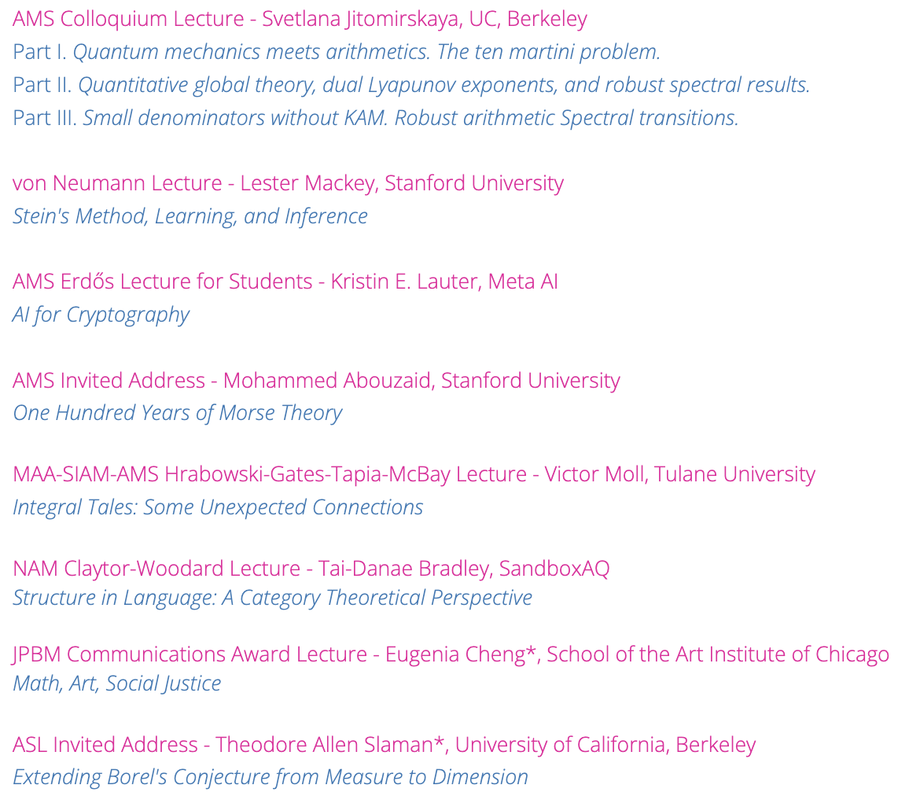

 

## Movies

> "It's not what a movie is about, it's how it is about it." --- Roger Ebert 

- City Lights (1931 d. Charlie Chaplin)
- Modern Times (1936 d. Charlie Chaplin)
- The Great Dictator (1940 d. Charlie Chaplin) **Massive favorite**
- Good Will Hunting (1997 d. Gus Van Sant)
- Miss Americana (2020 d. Lana Wilson)
- Robot Dreams (2024 d. Pablo Berger)

## Music 

> "People haven't always been there for me but music always has." --- Taylor Swift

- Pistol Annies: *Hell on Heels* (2011) // *Annie Up* (2013) (country)
- Fake Fruit: *Mucho Mistrust* (2024, alternative/indie)
- Cornershop: *When I Was Born for the Seventh Time* (1997, alternative/indie)
- Fatboy Slim: *Halfway Between the Gutter and the Stars*  (2000, big beat/electronic)
- Massive Attack: *Protection* (1994, trip-hop/electronic)
- The Streets: *Original Pirate Material* (2002) // *The Hardest Way to Make an Easy Living* (2006)  (alt hip-hop/grime/electronica)
- Dessa: *A Badly Broken Code* (2010, hip-hop)
- Jack Harlow: *Jackman* (2023, rap/hip-hop)
- Ren: *Sick Boi* (2024, R&B/hip-hop/rap)
- Doechii: *Alligator Bites Never Heal* (2024, R&B/hip-hop)
- Tierra Whack: *World Wide Whack* (2024, hip-hop/jazz funk)
- Dudu Pukwana: *In the Townships* (1974 jazz/South Africa)
- James Brandon Lewis: *Apple Core* (2025, jazz)
- *Mozart: Piano Sonatas* by Christoph Eschenbach (1999, classical)
- *Bach: Goldberg Variations* by Murray Perahia (1971, classical)
  

### Concerts

- *Strings for Peace*. Ustad Amjad Ali Khan & Sharon Isbin. Herbst Theatre in SF, California, on Saturday, February 22, 2025.   <small>Crossing barriers of language and culture and uniting people through music, classical guitarist Sharon Isbin and sarod master Amjad Ali Khan find common ground in their respective classical traditions of ragas and European medieval music, interweaving musical, spiritual, and artistic legacies.</small>

## Books

> "What really knocks me out is a book that, when you're all done reading it, you wish the author that wrote it was a terrific friend of yours and you could call him up on the phone whenever you felt like it. That doesn't happen much, though." --- J.D. Salinger, The Catcher in the Rye

- *Siddhartha* by Herman Hesse. 1922
- *Love Story* by Erich Segal. 1970
- *Purpose: What Evolution and Human Nature Imply about the Meaning of Our Existence* by Samuel Wilkinson. 2024
- *Jonathan Livingston Seagull* by Richard Bach. 1970
- *Elliptic Tales: Curves, Counting, and Number Theory* by Avner Ash and Robert Gross. 2012

## Math 

### Joint Mathematics Meeting '25. Seattle, WA Jan 7--11.

#### Invited Talks

- **AMS Colloquium Lecture - Svetlana Jitomirskaya, UC, Berkeley**  
Part I. *Quantum mechanics meets arithmetics. The ten martini problem.*  
Part II. *Quantitative global theory, dual Lyapunov exponents, and robust spectral results.*  
Part III. *Small denominators without KAM. Robust arithmetic Spectral transitions.*  

- **von Neumann Lecture - Lester Mackey, Stanford University**  
*Stein's Method, Learning, and Inference*

- **AMS Erdős Lecture for Students - Kristin E. Lauter, Meta AI**  
*AI for Cryptography*

- **AMS Invited Address - Mohammed Abouzaid, Stanford University**  
_One Hundred Years of Morse Theory_

- **MAA-SIAM-AMS Hrabowski-Gates-Tapia-McBay Lecture - Victor Moll, Tulane Univ.**  
_Integral Tales: Some Unexpected Connections_

- **NAM Claytor-Woodard Lecture - Tai-Danae Bradley, SandboxAQ**  
_Structure in Language: A Category Theoretical Perspective_

- **JPBM Communications Award Lecture - Eugenia Cheng, School of the Art Institute of Chicago**  
_Math, Art, Social Justice_

- **ASL Invited Address - Theodore Allen Slaman, University of California, Berkeley**  
_Extending Borel's Conjecture from Measure to Dimension_

[//]: # ()

#### Special Sessions

### Stanford University, Math Department Talks
 

## Travel

> "Not all those who wander are lost." --- J.R.R. Tolkien, The Fellowship of the Ring

- **Seattle, WA --- Jan 7--11**. Joint Mathematics Meeting (JMM25). Got to hang out with SE; food was beyond amazing --- Halal Smash'd Burgers, Moroccan lamb roll, curry beef hom bao, dinner at *Zaika* with SE and family.
- **Pasadena, CA --- Jan 24--26**. Caltech Math Meet (CMM). Road trip with dad. Had *Din Tai Fung* for both dinners. Highlight: listening to music on the drive to and from. It was snowing near LA on the way back!!
- **Boston, MA --- Feb 14--16**. Harvard-MIT Math Tournament (HMMT Feb). Got to hang out with WZ; dinner from *Himalayan Kitchen* on Fri; "*Ghana Bitter*" from Royce chocolates on Sat. Several inches of snow coated the streets from a storm Saturday night into Sunday morning.
- **San Francisco, CA --- Feb 22**. *Strings for Peace*. Ustad Amjad Ali Khan & Sharon Isbin. Dinner at *Mochica Peruvian* followed by hangout at the corner bookstore. Concert at Herbst Theater from 730PM--10PM. It was fantastic!
