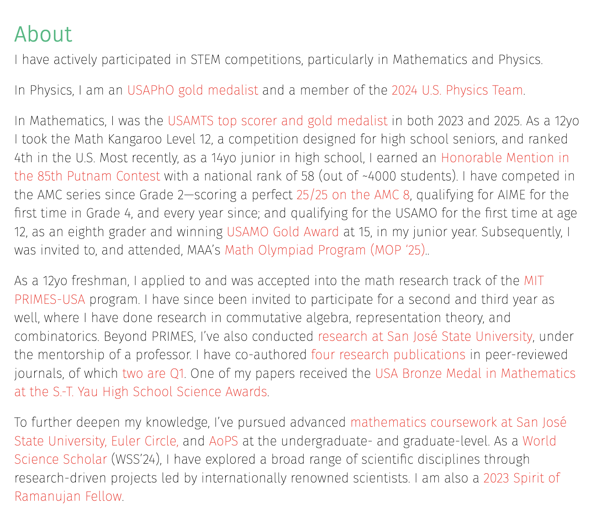
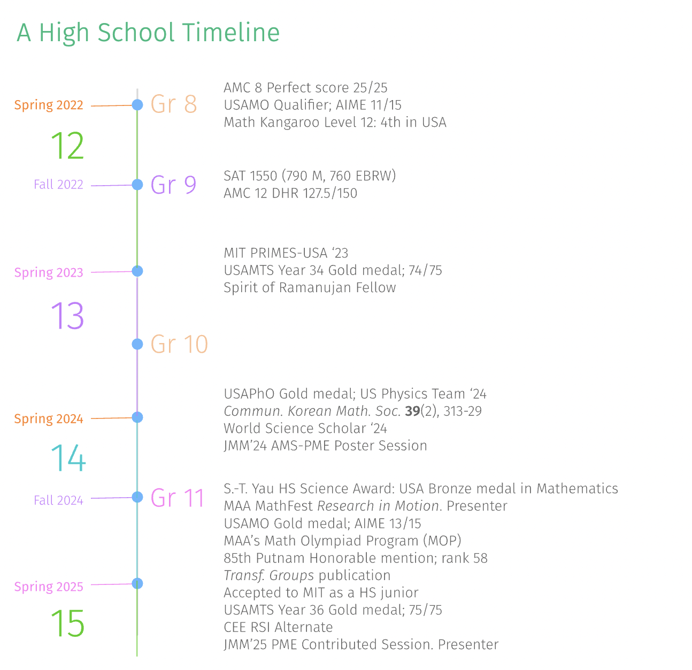

  

 

 

## Coursework grouped by institution

### San José State University

**𝗚𝗿𝗮𝗱𝘂𝗮𝘁𝗲 𝗖𝗼𝘂𝗿𝘀𝗲𝘀**

- MATH 221A 𝘏𝘪𝘨𝘩𝘦𝘳 𝘈𝘭𝘨𝘦𝘣𝘳𝘢 𝘐 (A)
- MATH 221B 𝘏𝘪𝘨𝘩𝘦𝘳 𝘈𝘭𝘨𝘦𝘣𝘳𝘢 𝘐𝘐 (A+)
- MATH 226 𝘛𝘩𝘦𝘰𝘳𝘺 𝘰𝘧 𝘕𝘶𝘮𝘣𝘦𝘳𝘴 (A+)
- MATH 285M 𝘌𝘭𝘭𝘪𝘱𝘵𝘪𝘤 𝘊𝘶𝘳𝘷𝘦𝘴 & 𝘔𝘰𝘥𝘶𝘭𝘢𝘳 𝘍𝘰𝘳𝘮𝘴 (A+)
- MATH 231A 𝘙𝘦𝘢𝘭 𝘈𝘯𝘢𝘭𝘺𝘴𝘪𝘴 (A+)
- MATH 231B 𝘍𝘶𝘯𝘤𝘵𝘪𝘰𝘯𝘢𝘭 𝘈𝘯𝘢𝘭𝘺𝘴𝘪𝘴 (A+)
- MATH 238 𝘈𝘥𝘷𝘢𝘯𝘤𝘦𝘥 𝘊𝘰𝘮𝘱𝘭𝘦𝘹 𝘝𝘢𝘳𝘪𝘢𝘣𝘭𝘦𝘴 (A+)
- MATH 233A 𝘗𝘢𝘳𝘵𝘪𝘢𝘭 𝘋𝘪𝘧𝘧𝘦𝘳𝘦𝘯𝘵𝘪𝘢𝘭 𝘌𝘲𝘶𝘢𝘵𝘪𝘰𝘯𝘴 (A+)
- MATH 234 𝘈𝘥𝘷𝘢𝘯𝘤𝘦𝘥 𝘋𝘺𝘯𝘢𝘮𝘪𝘤𝘢𝘭 𝘚𝘺𝘴𝘵𝘦𝘮𝘴 (A+)
- MATH 285A 𝘚𝘵𝘰𝘤𝘩𝘢𝘴𝘵𝘪𝘤 𝘔𝘦𝘵𝘩𝘰𝘥𝘴 (A)
- MATH 229 𝘈𝘥𝘷𝘢𝘯𝘤𝘦𝘥 𝘔𝘢𝘵𝘳𝘪𝘹 𝘛𝘩𝘦𝘰𝘳𝘺 (A+)
- MATH 285M 𝘕𝘰𝘯𝘯𝘦𝘨𝘢𝘵𝘪𝘷𝘦 𝘔𝘢𝘵𝘳𝘪𝘤𝘦𝘴 (A+)
- MATH 275A 𝘛𝘰𝘱𝘰𝘭𝘰𝘨𝘺 (A+)
- MATH 279A 𝘎𝘳𝘢𝘱𝘩 𝘛𝘩𝘦𝘰𝘳𝘺 (A+)

**𝗨𝗻𝗱𝗲𝗿𝗴𝗿𝗮𝗱𝘂𝗮𝘁𝗲 𝗖𝗼𝘂𝗿𝘀𝗲𝘀**

- MATH 129A 𝘓𝘪𝘯𝘦𝘢𝘳 𝘈𝘭𝘨𝘦𝘣𝘳𝘢 𝘐 (A)
- MATH 129B 𝘓𝘪𝘯𝘦𝘢𝘳 𝘈𝘭𝘨𝘦𝘣𝘳𝘢 𝘐𝘐 (A+)
- MATH 131A 𝘐𝘯𝘵𝘳𝘰𝘥𝘶𝘤𝘵𝘪𝘰𝘯 𝘵𝘰 𝘈𝘯𝘢𝘭𝘺𝘴𝘪𝘴 (A+)
- MATH 131B 𝘐𝘯𝘵𝘳𝘰𝘥𝘶𝘤𝘵𝘪𝘰𝘯 𝘵𝘰 𝘙𝘦𝘢𝘭 𝘝𝘢𝘳𝘪𝘢𝘣𝘭𝘦𝘴 (A+)
- MATH 138 𝘊𝘰𝘮𝘱𝘭𝘦𝘹 𝘝𝘢𝘳𝘪𝘢𝘣𝘭𝘦𝘴 (A+)
- MATH 179 𝘐𝘯𝘵𝘳𝘰𝘥𝘶𝘤𝘵𝘪𝘰𝘯 𝘵𝘰 𝘎𝘳𝘢𝘱𝘩 𝘛𝘩𝘦𝘰𝘳𝘺 (A+)

### Euler Circle

- 𝘊𝘰𝘮𝘣𝘪𝘯𝘢𝘵𝘰𝘳𝘪𝘢𝘭 𝘎𝘢𝘮𝘦 𝘛𝘩𝘦𝘰𝘳𝘺
- 𝘊𝘰𝘮𝘣𝘪𝘯𝘢𝘵𝘰𝘳𝘪𝘤𝘴
- 𝘎𝘦𝘯𝘦𝘳𝘢𝘵𝘪𝘯𝘨 𝘍𝘶𝘯𝘤𝘵𝘪𝘰𝘯𝘴
- 𝘈𝘣𝘴𝘵𝘳𝘢𝘤𝘵 𝘈𝘭𝘨𝘦𝘣𝘳𝘢
- 𝘙𝘪𝘯𝘨 𝘛𝘩𝘦𝘰𝘳𝘺 & 𝘈𝘭𝘨𝘦𝘣𝘳𝘢𝘪𝘤 𝘎𝘦𝘰𝘮𝘦𝘵𝘳𝘺
- 𝘙𝘦𝘢𝘭 𝘈𝘯𝘢𝘭𝘺𝘴𝘪𝘴
- 𝘋𝘪𝘧𝘧𝘦𝘳𝘦𝘯𝘵𝘪𝘢𝘭 𝘎𝘦𝘰𝘮𝘦𝘵𝘳𝘺
- 𝘊𝘰𝘮𝘱𝘭𝘦𝘹 𝘈𝘯𝘢𝘭𝘺𝘴𝘪𝘴 𝘐 & 𝘐𝘐
- 𝘈𝘯𝘢𝘭𝘺𝘵𝘪𝘤 𝘕𝘶𝘮𝘣𝘦𝘳 𝘛𝘩𝘦𝘰𝘳𝘺 
- 𝘕𝘶𝘮𝘣𝘦𝘳 𝘛𝘩𝘦𝘰𝘳𝘺
- 𝘌𝘳𝘨𝘰𝘥𝘪𝘤 𝘛𝘩𝘦𝘰𝘳𝘺 
- 𝘔𝘢𝘳𝘬𝘰𝘷 𝘊𝘩𝘢𝘪𝘯𝘴

### Art of Problem Solving 

**𝗠𝗮𝘁𝗵𝗲𝗺𝗮𝘁𝗶𝗰𝘀**
- 𝘎𝘳𝘰𝘶𝘱 𝘛𝘩𝘦𝘰𝘳𝘺 (A+)
- 𝘊𝘢𝘭𝘤𝘶𝘭𝘶𝘴 (A+)
- 𝘐𝘯𝘵𝘦𝘳𝘮𝘦𝘥𝘪𝘢𝘵𝘦 𝘈𝘭𝘨𝘦𝘣𝘳𝘢 (A+)
- 𝘖𝘭𝘺𝘮𝘱𝘪𝘢𝘥 𝘎𝘦𝘰𝘮𝘦𝘵𝘳𝘺 (A+)

**𝗣𝗿𝗼𝗴𝗿𝗮𝗺𝗺𝗶𝗻𝗴**
- 𝘐𝘯𝘵𝘦𝘳𝘮𝘦𝘥𝘪𝘢𝘵𝘦 𝘗𝘳𝘰𝘨𝘳𝘢𝘮𝘮𝘪𝘯𝘨 𝘸𝘪𝘵𝘩 𝘗𝘺𝘵𝘩𝘰𝘯 (A+)

 

 

## The Four Agreements

1. **Be Impeccable With Your Word**  
Speak with integrity. Say only what you mean. Avoid using the word to speak against yourself or to gossip about others. Use the power of your word in the direction of truth and love.  

2. **Don't Take Anything Personally**  
Nothing others do is because of you. What others say and do is a projection of their own reality, their own dream. When you are immune to the opinions and actions of others, you won't be the victim of needless suffering.  

3. **Don't Make Assumptions**  
Find the courage to ask questions and to express what you really want. Communicate with others as clearly as you can to avoid misunderstandings, sadness and drama. With just this one agreement, you can completely transform your life.  

4. **Always Do Your Best**  
Your best is going to change from moment to moment; it will be different when you are healthy as opposed to sick. Under any circumstance, simply do your best, and you will avoid self-judgment, self-abuse and regret.”  

--- Don Miguel Ruiz

 

"Don't aim at success. The more you aim at it and make it a target, the more you are going to miss it. For success, like happiness, cannot be pursued; it must ensue, and it only does so as the unintended side effect of one's personal dedication to a cause greater than oneself or as the by-product of one's surrender to a person other than oneself. Happiness must happen, and the same holds for success: you have to let it happen by not caring about it. I want you to listen to what your conscience commands you to do and go on to carry it out to the best of your knowledge. Then you will live to see that in the long-run—in the long-run, I say!—success will follow you precisely because you had forgotten to think about it"  
--- Viktor E. Frankl, _Man’s Search for Meaning_

 

"I hope that in this year to come, you make mistakes.

Because if you are making mistakes, then you are making new things, trying new things, learning, living, pushing yourself, changing yourself, changing your world. You're doing things you've never done before, and more importantly, you're Doing Something.

So that's my wish for you, and all of us, and my wish for myself. Make New Mistakes. Make glorious, amazing mistakes. Make mistakes nobody's ever made before. Don't freeze, don't stop, don't worry that it isn't good enough, or it isn't perfect, whatever it is: art, or love, or work or family or life.

Whatever it is you're scared of doing, Do it.

Make your mistakes, next year and forever."

--- Neil Gaiman

“I hope that one day you will have the experience of doing something you do not understand for someone you love.”  
--- Jonathan Safran Foer, _Extremely Loud & Incredibly Close_

Nobody tells this to people who are beginners, and I really wish somebody had told this to me.

All of us who do creative work, we get into it because we have good taste. But it’s like there is this gap. For the first couple years that you’re making stuff, what you’re making isn’t so good. It’s not that great. It’s trying to be good, it has ambition to be good, but it’s not that good.

But your taste, the thing that got you into the game, is still killer. And your taste is good enough that you can tell that what you’re making is kind of a disappointment to you. A lot of people never get past that phase. They quit.

Everybody I know who does interesting, creative work they went through years where they had really good taste and they could tell that what they were making wasn’t as good as they wanted it to be. They knew it fell short. Everybody goes through that.

And if you are just starting out or if you are still in this phase, you gotta know its normal and the most important thing you can do is do a lot of work. Do a huge volume of work. Put yourself on a deadline so that every week or every month you know you’re going to finish one story. It is only by going through a volume of work that you’re going to catch up and close that gap. And the work you’re making will be as good as your ambitions.

I took longer to figure out how to do this than anyone I’ve ever met. It takes awhile. It’s gonna take you a while. It’s normal to take a while. You just have to fight your way through that.

—Ira Glass

